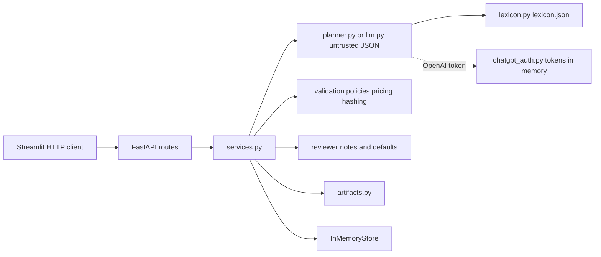
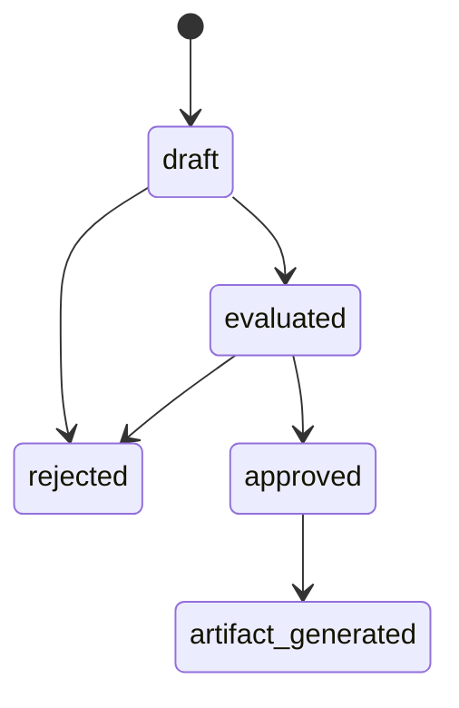

# Prompt-to-Provisioning Planner

## Purpose

The application turns a plain-language infrastructure request into a reviewable deployment plan. A person describes what they want. The system proposes a structured plan, checks it, prices it, and waits for an explicit approve or reject. Only an approved plan can be rendered as Terraform-style configuration, and that file is a dry run: the application does not deploy anything.

Example request: “A small PostgreSQL database and two web containers for a development team in US East, optimized for low cost.”

## How this architecture is produced

The architecture is defined first, from the plan. It fixes the trust boundary, the module layout, the state machine, and the API before feature code is written.

Implementation then proceeds by prompting against this document, one slice at a time. A prompt may fill in the slice it names. It does not add services, persistence, cloud access, or a second trust boundary. Where a prompt and this document disagree, this document wins and the code is corrected.

## Scope

### In scope

- Accept one natural-language prompt and return a persisted plan.
- Propose plan JSON from a deterministic mock planner with a small vocabulary, plus fixed `SCENARIO:` payloads for invalid and edge cases. A DevOps lexicon rewrites synonyms, quantity phrasing, and one-letter typos first, and every rewrite is reported.
- Optionally, send the same prompt to an allowlisted OpenAI or Anthropic model. Its reply is treated as exactly as untrusted as the mock's.
- Optionally, let an OpenAI call use a "Sign in with ChatGPT" session instead of an API key. The tokens stay in API process memory.
- Tell the reviewer which values were defaulted because the request did not state them.
- Parse that JSON and validate it against a strict schema. Invalid generator output is stored and returned; it is not rejected at the HTTP layer and it is not repaired.
- Evaluate a fixed set of policies and a local synthetic price catalog.
- Let a reviewer approve an evaluated plan or reject a draft or evaluated plan. Approval is bound to a canonical hash of the proposal. Rejection uses the plan id only and keeps the stored proposal, hash, and evaluation results.
- After approval, render a deterministic dry-run HCL document.
- Expose the lifecycle over HTTP and a Streamlit client that calls only that HTTP API.
- Run the API and UI together with Docker Compose, and locally without Docker.

### Out of scope

- A *required* language-model client, paid APIs as a dependency, or prompt repair. The optional model adapter is off by default and needs a key per request, or a ChatGPT sign-in for OpenAI.
- Cloud accounts, credentials, provider SDKs, and Terraform CLI (`init`, `plan`, `apply`).
- Real `aws_*` or `azurerm_*` resources, Bicep, Kubernetes, or any path that creates infrastructure.
- A database, authentication of this application's users, multi-user sessions, queues, webhooks, or a deploy pipeline. The ChatGPT sign-in is an outbound credential for calling OpenAI. It is not a login to this application.
- Editing a plan in place, a policy language, a cost optimizer, or quota lookups.

### Boundaries that follow from scope

One FastAPI process and one Streamlit process. Streamlit is an HTTP client. Plan state lives in the API process memory and is gone after a restart. Create and evaluate happen in a single `POST /v1/plans`. There is no patch or edit API.

## Architectural drivers

| Driver | Consequence |
|---|---|
| Untrusted proposal | The planner returns a string. It cannot validate, price, approve, or render. |
| Deterministic control | Schema, policy, price, hash, approval, and HCL are ordinary Python. |
| Fail closed | Unknown type, SKU, region, or required value blocks approval. Unpriced lines are not dropped. |
| Review before render | HCL exists only after approval, and only if the stored proposal still matches the evaluated hash. |
| No deployment | HCL uses a private `demo_*` resource namespace and states that nothing was deployed. |

## Trust boundary

Everything to the right of the planner is trusted application code. The planner may emit tags that happen to satisfy policy; policy code still evaluates them. Generator output is never normalized to make it pass.

Malformed JSON, extra fields, missing fields, and type errors are stored as validation errors on a `draft` record. The create call still returns **201**. That outcome is part of the contract, because the generator is not a trusted client. Approval of that draft returns **409**.

## Components

Flat layout under `app/`, `ui/`, and `tests/`. No `src/` tree, no domain/infrastructure split, and no repository interface. Business rules live in `services.py` and the modules it calls. Route handlers validate HTTP input, call the service, and map results to status codes.

`Resource` and `ProposedPlan` are the generator contract. `PlanRecord` is the stored aggregate after deterministic steps. The generator cannot supply status, cost, policy results, hashes, approval flags, or artifacts.

| Module | Responsibility | Must not |
|---|---|---|
| `planner.py` | Return a JSON string from vocabulary or a `SCENARIO:` fixture. Report its rewrites (`explain`) and what the request named (`stated_details`). | Validate, score policy, price, approve, render, or repair JSON. |
| `lexicon.py` | Rewrite request text from `lexicon.json`: synonyms, quantity phrasing, one-edit typos toward distinctive words. Refuse unsupported resources and regions. | Correct silently, or correct toward a word with common English look-alikes. |
| `llm.py` | One HTTP call to an allowlisted model: JSON-only, low effort, 32 KB reply cap. With a ChatGPT sign-in, one streamed Responses API call that counts only after `response.completed`. | Store or log the key; repair or validate the reply. |
| `chatgpt_auth.py` | "Sign in with ChatGPT": OAuth 2.0 with PKCE, one-time `state` that expires after 10 minutes, code exchange, refresh, sign-out. Hands `llm.py` a token and the account's model list. The access log shows the callback as `/callback?[redacted]`. | Log, return, persist, or store a token on a record; log the OAuth code or state; call a model. |
| `validation.py` | `json.loads`, then `ProposedPlan.model_validate`. | Change or default invalid fields. |
| `policies.py` | Return policy results. | Mutate the plan. |
| `pricing.py` | Sum the local catalog with `Decimal`. | Approve, render, or skip an unpriced line. |
| `hashing.py` | Canonical SHA-256. | Change `plan_hash` except at evaluation. |
| `services.py` | Own state transitions. Record `interpretation_notes` and `defaults_applied` as reviewer hints. | Call a cloud SDK or Terraform; let a note block approval or enter the hash. |
| `artifacts.py` | Render HCL after approval and a fresh hash check. | Render when status is not approved or the hash drifted. |
| `store.py` | Get and put records. | Apply policy or pricing. |
| `ui/app.py` | Present the plan, send the stored hash on approve, and reject with the plan id only. | Import `app.services`, `app.store`, `app.policies`, or any other domain module. |

`Planner` is an optional five-line protocol: `generate(prompt: str) -> str`. The only implementation is `MockPlanner`. The model adapter in `llm.py` is called by the route, not through the protocol, and its string goes through the same service path.

### Technology

| Choice | Role |
|---|---|
| Python 3.12 | Runtime. |
| FastAPI | HTTP API. |
| Pydantic v2 | Schema. Generated models use `extra="forbid"`. |
| Jinja2 | Deterministic HCL. The template is not executed. |
| httpx | The optional model call and the ChatGPT OAuth exchange. Tests replace it with `httpx.MockTransport`. |
| Streamlit | UI. Reads `API_BASE_URL`, default `http://localhost:8000`. Compose sets `API_BASE_URL=http://api:8000`. |
| pytest and TestClient | Tests. An empty store is injected with `dependency_overrides`. Docker is not required to test. |
| `requirements.txt` | Runtime dependencies at the repository root. Test-only packages stay in `requirements-dev.txt`. |

## Request flow

`POST /v1/plans` with `{ "prompt": str }` creates the record and evaluates it when the schema allows.

1. Streamlit sends the prompt, which must be 30 to 2,000 characters unless it is a `SCENARIO:` token.
2. The mock planner normalizes DevOps wording, then returns a JSON string. For the example above: region `us-east-1`, environment `dev`, tags `environment`, `owner=dev-team`, `cost-center=engineering`, one `postgres` / `db-small`, and two `container` / `container-small`.
3. Validation parses and checks the schema.
4. If the schema fails, the record stays `draft`, `proposed` is null, and policy, pricing, and hashing do not run.
5. If the schema passes, policies and pricing run, then `plan_hash` is set once. Status becomes `evaluated` even when a policy or the price check fails. The service records `interpretation_notes` and `defaults_applied`.
6. The UI shows a verdict banner, the defaults and readings, the raw JSON, the validated plan, the policy table, and the synthetic cost.
7. Approve submits the `plan_hash` from that response. Reject submits the plan id only.
8. Artifact generation runs only after approval and a second hash check. It stores the HCL on the record and sets `artifact_generated`. The artifact route returns that updated record. A rejected plan cannot generate an artifact. Generating again is refused; the stored HCL is read with `GET /v1/plans/{plan_id}`.

Vocabulary covers postgres/database/db, mysql, container/web application/website/app server, object storage/blob storage, dev/test/staging/qa/prod, US East or Northern Virginia → `us-east-1`, US West or Oregon → `us-west-2`, Azure East US → `eastus2`, small/medium/big/large/low cost, quantities one through ten, pair, couple, dozen, or a number, and GB or TB capacity. "No", "not", or "without" directly before a resource omits it. Policy allow-lists are in `app/data/policy.json`. Prices, including the higher large and MySQL rates, are in `app/data/prices.json`. A prompt with no region phrase still uses `us-east-1`. Another `US <direction>` or `Azure` region phrase, for example `US NORTH`, is an interpretation error. A prompt with no recognized resource is also an interpretation error. Validation stores a draft and approval is refused.

The same request can optionally be sent to OpenAI (`gpt-5`) or Anthropic (`claude-sonnet-5-5`). The person chooses the provider. The model is fixed. The key is not stored. For OpenAI, a blank key falls back to an active ChatGPT sign-in, the model must come from that account's model list, and the generator is labelled `openai-chatgpt:<model>`. A typed key always wins. The returned text is still an untrusted string, and the checks below are unchanged. `GET /v1/decisions` lists plans whose status is `approved`, `rejected`, or `artifact_generated`. `GET /v1/catalog/prices` and `GET /v1/catalog/policy` return the JSON tables the UI shows.

Changing the prompt creates a new plan. Reject does not edit the request. It records that this plan must not be approved.

If the prompt contains `SCENARIO:<name>`, vocabulary parsing is skipped and a fixed string is returned. It applies to the built-in planner. Names: `malformed`, `missing_region`, `missing_tags`, `unknown_type`, `unsupported_sku`, `excessive_qty`, `public_storage`, `extra_fields`, `bad_region`. Scenario payloads are not repaired, and none can be approved.

## States

`draft` may become `evaluated` or `rejected`. `evaluated` may become `approved` or `rejected`. `approved` may become `artifact_generated`. `rejected` is terminal. A new request is a new `POST /v1/plans`.

| From | Allowed | Refused |
|---|---|---|
| `draft` | Reject | Approve, artifact |
| `evaluated` | Approve when every approval gate passes, or reject | Artifact |
| `approved` | Artifact when the current hash still matches | Approve again, reject |
| `rejected` | None | Approve, reject, artifact |
| `artifact_generated` | Read the stored record, including `artifact` | Approve again, reject, generate again |

A policy error or a pricing failure leaves the record `evaluated`. A warning does not block approval. Callers read validation errors, policy statuses, and `cost.succeeded` on the `PlanRecord`. `status == evaluated` alone does not mean approve will succeed. Any validation error, policy `error`, or pricing failure makes approve return **409**. The plan response has no `approval_blocked` field, and that condition is not a column on the stored record.

## Approval and integrity

`canonical_json` and `canonical_hash` accept a validated `ProposedPlan` and do not mutate it. They do not read the store or refresh a stored hash.

Serialization uses the proposal only:

1. `proposed.model_dump(mode="json")` includes every proposed-plan field: region, environment, tags, and each resource’s type, name, SKU, quantity, `capacity_gb`, and `public_access`. `capacity_gb` is JSON `null` when the resource has no capacity. Record id, status, timestamps, raw planner text, policies, and cost are not included.
2. `json.dumps(..., sort_keys=True, separators=(",", ":"), ensure_ascii=False, allow_nan=False)` sorts dictionary keys and leaves resource list order unchanged. The plan is not otherwise reordered or normalized. Unicode is encoded as UTF-8, not as `\u` escapes.
3. `canonical_hash` is the lowercase SHA-256 hexadecimal digest of those UTF-8 bytes.

Evaluation writes `plan_hash` once. Approval and artifact generation recompute `current_hash` and do not store it. Writing the recomputed value back would accept a plan that changed after evaluation. Rejection does not recompute a hash and does not replace the stored one.

Both approval comparisons use `hmac.compare_digest`. On approval and artifact generation, if `proposed` is missing, the current hash is treated as a mismatch.

Approval succeeds only when all of the following are true:

1. `status == evaluated`
2. The submitted hash equals the stored `plan_hash`
3. The recomputed hash equals the stored `plan_hash`
4. `validation_errors` is empty
5. No policy result has `status=error`
6. Pricing succeeded: `cost` is present, `succeeded` is true, it has no pricing errors, and `monthly_total` is present

The submitted hash must be 64 lowercase hexadecimal characters. Any other shape is **409** with a code that names the problem (`missing_submitted_hash`, `malformed_submitted_hash`, `non_ascii_submitted_hash`).

The submitted hash ties the reviewer to the evaluation they were shown. The recomputed hash detects a `proposed` value changed in the store afterward. Submitting the old hash after that change returns **409**.

Rejection requires the plan id and no submitted hash. `draft` and `evaluated` may become `rejected`. The proposal, hash, and evaluation results stay as stored. Rejection does not apply the approval gates. `approved`, `rejected`, and `artifact_generated` cannot be rejected. A rejected plan cannot be approved.

Artifact generation requires `approved` and `current_hash == plan_hash`. The route returns the updated `PlanRecord`, with the HCL in `artifact`. Hash drift after approval returns **409** and does not render. A rejected plan cannot generate an artifact. A plan that is already `artifact_generated` is refused with **409**; clients read the saved HCL from the stored record.

Unknown ids are **404**. Illegal transitions are **409** and name the gate that failed. Error responses do not include stack traces.

## Schema, policy, and pricing

These are three different failures. A value can be structurally valid and still be illegal or unpriced.

**Schema.** `Resource` and `ProposedPlan` forbid unknown fields. `quantity` and `capacity_gb` are strict integers in range: booleans, floats (including `2.0`), and numeric strings are invalid. `quantity` is 1–100. `object_storage` requires `capacity_gb > 0`. Region, resource name, SKU, and tag text must be non-blank after trim; the original string is what is stored. `container`, `postgres`, and `mysql` must omit `capacity_gb`. Resource type is the enum `container`, `postgres`, `mysql`, or `object_storage`, so an unknown type never reaches policy. Region is at most 32 characters, and each tag key and value at most 128. SKU is a string of 1–64 non-blank characters, not an enum, so an unknown SKU is representable and pricing can fail closed. Region is a non-blank string; the allowed set is a policy, not a schema enum. Required tag keys are also a policy. The schema only rejects blank tag keys and values.

A validation issue has `code`, `message`, and optional `field_path`. A JSON parse failure produces one issue: `code` is `json_invalid`, `field_path` is null, and `message` is `{JSONDecodeError.msg} at line {lineno} column {colno}`. A schema failure produces one issue per Pydantic error. `code` is that error's `type` string, such as `missing`, `extra_forbidden`, `enum`, `int_type`, `greater_than`, `value_error`, or `model_type`. `message` is the Pydantic `msg` with a leading `Value error, ` removed when present. `field_path` joins the error location with `.`, and each integer index is written as `[n]` on the preceding component (`resources[0].sku`). An empty location leaves `field_path` null.

**Policy.** Each policy is `ProposedPlan -> list[PolicyResult]` and does not mutate the plan. A result carries `policy_id`, `status` (`passed`, `warning`, `error`), `message`, and optional `resource_name` and `field_path`. A policy with nothing to report still emits one `passed` row so the review always lists every policy. Thresholds and allow-lists are read from `app/data/policy.json`. The functions decide what those values mean, so the file holds data, not rules.

| policy_id | Rule | On violation |
|---|---|---|
| `allowed_regions` | Region is in `allowed_regions` (`us-east-1`, `us-west-2`, `eastus2`) | error |
| `required_tags` | `environment`, `owner`, and `cost-center` are present and non-blank | error, one per missing or blank key |
| `resource_limits` | Sum of container quantity ≤ 5; postgres quantity ≤ 2; mysql quantity ≤ 2; object-storage `capacity_gb × quantity`, summed, ≤ 500 | error |
| `dev_sku_tier` | When `environment` is `dev`, every SKU is in `dev_allowed_skus` for its type (small, medium, and large tiers today) | error |
| `storage_public` | `object_storage` with `public_access=true` | error |
| `dev_medium_cost` | `environment` is `dev` and a SKU is in `dev_warning_skus` (medium and large tiers) | warning |

Limits use `quantity` and `capacity_gb`, not the length of the resource list. There is no separate known-SKU policy. `eastus2` is stored and rendered as given; it is not rewritten to an AWS region.

**Pricing.** Prices load from `app/data/prices.json` and are synthetic. Construct every `Decimal` from a string.

| Type | SKU | Unit price |
|---|---|---|
| container | `container-small` | `18` per instance |
| container | `container-medium` | `42` per instance |
| container | `container-large` | `96` per instance |
| postgres | `db-small` | `35` per instance |
| postgres | `db-medium` | `95` per instance |
| postgres | `db-large` | `240` per instance |
| mysql | `mysql-small` | `49` per instance |
| mysql | `mysql-medium` | `140` per instance |
| mysql | `mysql-large` | `320` per instance |
| object_storage | `storage-standard` | `0.025` per GB |

The example request prices to `71.00` (`2 * 18 + 35`). Adding 100 GB of `storage-standard` prices to `73.50`. A missing type or SKU fails the estimate. A successful estimate has `succeeded=true`, no pricing errors, and `monthly_total` equal to the sum of line amounts. A failed estimate has `succeeded=false` and at least one pricing error. The API returns amounts as unquantized strings (see Open decisions). The UI shows them to two decimal places and labels them as synthetic estimates.

## Artifacts

Rendering does not change the stored proposal or its hash. The document uses `demo_*` resources only and starts with a comment that this is a prototype dry-run and nothing was deployed. The application never invokes Terraform or a cloud provider.

Tags are sorted by key, ascending, using Python's default string order. Resources are sorted by this tuple, independent of the proposal list order used for the hash:

`(type, name, sku, quantity, capacity_gb is not None, 0 if capacity_gb is None else capacity_gb, public_access)`

A missing capacity sorts before any stored size because `False` sorts before `True`. `public_access` false sorts before true. Type names sort lexicographically: `container`, `mysql`, `object_storage`, `postgres`. After sorting, labels are assigned per type as `container_0`, `mysql_0`, `object_storage_0`, `postgres_0`, and so on. The label is not derived from the resource name. Block types are `demo_container`, `demo_postgres`, `demo_mysql`, and `demo_object_storage`.

Region, environment, tag keys, tag values, resource names, and SKUs are user-influenced strings. Each is wrapped in double quotes. The escape function writes `\\` for backslash, `\"` for a quote, and `\n`, `\r`, and `\t` for newline, carriage return, and tab. Code points below U+0020, plus U+007F and U+0080 through U+009F, are written as `\u` and four lowercase hexadecimal digits. Every other character, including non-ASCII text, is copied unchanged. After that character pass, `${` is replaced with `$${` and `%{` with `%%{` so Terraform does not interpolate them. Jinja autoescape is off because the strings are escaped in Python before the template runs. `count`, `capacity_gb`, and `public_access` are not quoted user strings: counts and capacities are integers, and public access is the literal `true` or `false`.

## API

Base path `/v1`. JSON. No authentication.

| Method | Path | Behavior |
|---|---|---|
| `POST` | `/v1/plans` | Create and evaluate. **201** `PlanRecord`, including drafts that failed validation. Unknown `SCENARIO:` names are **422** `{ "code": "unknown_scenario", "message" }` and are not stored. |
| `GET` | `/v1/plans/{plan_id}` | **200** `PlanRecord`, or **404** `{ "code": "not_found", "message" }`. |
| `POST` | `/v1/plans/{plan_id}/approve` | Body `{ "plan_hash": str }`. **200** updated `PlanRecord`. **409** `{ "code", "message" }` when any approval gate fails. The service checks hash format. |
| `POST` | `/v1/plans/{plan_id}/reject` | No body. The plan id is the only input. `draft` or `evaluated` becomes `rejected` and keeps the proposal, hash, and evaluation results. **200** updated `PlanRecord`. **409** for `approved`, `rejected`, or `artifact_generated`. |
| `POST` | `/v1/plans/{plan_id}/artifact` | No body. **200** updated `PlanRecord` with the HCL in `artifact`. **409** when refused, including a rejected plan or a repeated call. |
| `GET` | `/v1/decisions` | Approved, rejected, and artifact plans, newest first. Read-only. |
| `GET` | `/v1/catalog/prices` | The synthetic price table. Rates stay JSON strings. Read-only. |
| `GET` | `/v1/catalog/policy` | The policy allow-lists from `policy.json`. Read-only. |
| `GET` | `/v1/schema/plan` | `ProposedPlan.model_json_schema()`. |
| `GET` | `/v1/openai/sign-in` | `{ "authorize_url" }` to start "Sign in with ChatGPT". |
| `GET` | `/callback` | OAuth loopback target on `127.0.0.1:{OPENAI_CALLBACK_PORT}`. Plain escaped HTML page; **400** when the state, code, or exchange fails. |
| `GET` | `/v1/openai/session` | `{ "signed_in", "models" }`, plus `message` when a check failed. Never a token. |
| `POST` | `/v1/openai/sign-out` | Forget the sign-in. Returns the session body. |
| `GET` | `/health` | `{ "status": "ok", "service": "prompt-to-provisioning-planner" }`. |

`POST /v1/plans` also accepts optional `provider` (`mock`, `openai`, `claude`), `model`, and `api_key`. The prompt must be 30 to 2,000 characters after trimming; a `SCENARIO:` prompt is exempt from the minimum. A provider failure is **422** `{ "code": "provider_error", "message" }` and is not stored. An HTTP 401 from the ChatGPT plan route signs the session out.

Plan routes return `PlanRecord`: `id`, `prompt`, `raw_output`, `generator`, `status`, `proposed`, `plan_hash`, `validation_errors`, `policy_checks`, `cost`, `interpretation_notes`, `defaults_applied`, `artifact`, `created_at`, `updated_at`. `raw_output` is the untrusted generator string. `artifact` is null until generation and is included on the record after the artifact route succeeds. Later reads use the same record. Currency amounts are JSON strings from Pydantic, not floats. Blank prompts, extra request fields, non-string values, and invalid UUIDs use FastAPI's **422** `detail` body. Service errors contain only `code` and `message`, with no stack trace.

Run one API worker. Route handlers are async and call the service synchronously, with no await during a transition. The store is not locked.

Streamlit disables approve when the record has validation errors, a policy `error`, or pricing that did not succeed. It sends the stored hash on approve, rejects with the plan id only, and offers `main.tf` from the record's `artifact` field only after approval.

Tests that must change a proposal after evaluation write the store directly. They do not go through an edit API.

## Persistence

`InMemoryStore` is a `dict` keyed by plan id. `create`, `get`, and `update` return deep copies, so a caller cannot change the stored plan by mutating the object it received. `update` keeps the original `created_at` and sets `updated_at`. Creating an id that already exists is an error. Updating a missing id is an error. Get of a missing id returns no record, which the API maps to **404**.

Deep copies stop accidental aliasing. They are not a lock and not a durability mechanism. Run one API worker so requests do not share this dict across processes. The hash check is what detects a proposal that was intentionally replaced after evaluation. Restarting the API drops every plan. The UI must not assume an id survives a process restart.

## Test strategy

Tests assert behavior: HTTP status, stored status, validation errors, policy rows, `Decimal` totals, hash mismatch, and rendered text. They do not assert private call order.

Required cases include a valid generated plan, malformed JSON, missing fields, unexpected fields, an unsupported region, missing tags, public object storage, excessive quantity, excessive storage, an unknown SKU, totals `71.00` and `73.50`, a warning that does not block, errors that do, a wrong submitted hash, mutation after evaluation, mutation after approval and before render, a rejected plan that cannot render, two identical renders, and the health endpoint. Later slices added:
- 51 realistic DevOps requests in `tests/planner_cases.json`, each with its expected plan or refusal
- an English look-alike guard for typo correction
- defaults call-outs
- provider request shapes, with no network
- the ChatGPT OAuth exchange, `state` reuse and expiry, refresh, sign-out, and streamed Responses events, through `httpx.MockTransport`
- the UI banners and prompt check
- `requirements.txt` listing every runtime import, because the Docker images install only that file

A defect fix adds a test that reproduces the defect.

## Implementation sequence

Prompt one slice at a time, and include that slice’s tests in the same prompt:

1. Domain models, in-memory store, and the health endpoint.
2. Mock planner and `SCENARIO:` fixtures.
3. Validation, the six policies, catalog pricing, and the canonical hash.
4. Plan service and the `/v1` routes, including the three-way hash check on approval. Rejection takes the plan id only.
5. Jinja2 `main.tf.j2`, rendered only after the artifact hash check.
6. Streamlit client.
7. Docker Compose, Dockerfiles, and a README that matches this architecture.
8. Hardening, added after the first build:
   - planner parsing fixes and the DevOps lexicon
   - model guardrails: JSON-only output, size limits, refusal handling, low effort
   - reviewer notes and defaults
   - clearer failure UI and the live prompt check
9. Optional "Sign in with ChatGPT" credential for the OpenAI planner, with tokens in API memory only.

## Open decisions

Resolve each remaining item inside the slice that needs it. Do not introduce a new component to settle them.

Resolved by the API routes:

- **Error body.** **404** and **409** return `{ "code", "message" }`. The `code` is the failed gate (`not_found` for a missing plan). The message includes that same code and no stack trace. Unknown scenario names return **422** with the same two fields and `code` `unknown_scenario`. Request validation uses FastAPI's **422** `detail` body.
- **Decimal encoding.** The API serializes `Decimal` money through Pydantic JSON as strings and does not convert money to float. The route does not quantize amounts; `Decimal("71")` is `"71"` and `Decimal("73.500")` is `"73.500"`.
- **Health payload.** `GET /health` returns `{ "status": "ok", "service": "prompt-to-provisioning-planner" }`.

Resolved by validation and artifact rendering:

- **Validation issue codes.** A JSON parse failure uses `code` `json_invalid` and a null `field_path`. A schema failure uses the Pydantic error `type` as `code`. Messages and `field_path` are specified under Schema.
- **HCL ordering and escaping.** Resources sort by `(type, name, sku, quantity, capacity_gb is not None, capacity or 0, public_access)`. Tags sort by key. The escape function and block labels are specified under Artifacts.

No open decisions remain for this prototype.
