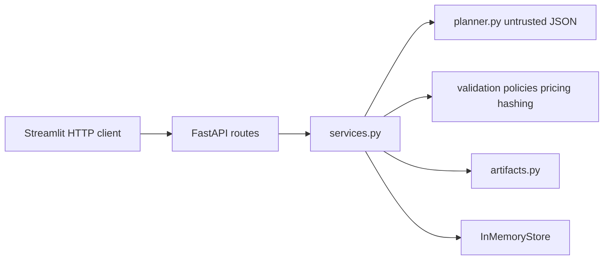
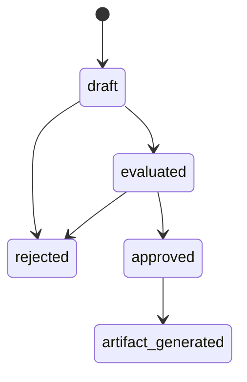

# Prompt-to-Provisioning Planner

## Purpose

The application turns a plain-language infrastructure request into a reviewable deployment plan. A person describes what they want. The system proposes a structured plan, checks it, prices it, and waits for an explicit approve or reject. Only an approved plan can be rendered as Terraform-style configuration, and that file is a dry run: the application does not deploy anything.

Example request: “A small PostgreSQL database and two web containers for a development team in US East, optimized for low cost.”

## How this architecture is produced

The architecture is defined first, from the plan. It fixes the trust boundary, the module layout, the state machine, and the API before feature code is written.

Implementation then proceeds by prompting against this document, one slice at a time. A prompt may fill in the slice it names. It does not add services, persistence, cloud access, or a second trust boundary. Where a prompt and this document disagree, this document wins and the code is corrected.

## Scope

### In scope

- Accept one natural-language prompt and return a persisted plan.
- Propose plan JSON from a deterministic mock planner with a small vocabulary, plus fixed `SCENARIO:` payloads for invalid and edge cases.
- Parse that JSON and validate it against a strict schema. Invalid generator output is stored and returned; it is not rejected at the HTTP layer and it is not repaired.
- Evaluate a fixed set of policies and a local synthetic price catalog.
- Let a reviewer approve an evaluated plan or reject a draft or evaluated plan. Approval is bound to a canonical hash of the proposal. Rejection uses the plan id only and keeps the stored proposal, hash, and evaluation results.
- After approval, render a deterministic dry-run HCL document.
- Expose the lifecycle over HTTP and a Streamlit client that calls only that HTTP API.
- Run the API and UI together with Docker Compose, and locally without Docker.

### Out of scope

- A real language-model client, paid APIs, or prompt repair.
- Cloud accounts, credentials, provider SDKs, and Terraform CLI (`init`, `plan`, `apply`).
- Real `aws_*` or `azurerm_*` resources, Bicep, Kubernetes, or any path that creates infrastructure.
- A database, authentication, multi-user sessions, queues, webhooks, or a deploy pipeline.
- Editing a plan in place, a policy language, a cost optimizer, or quota lookups.

### Boundaries that follow from scope

One FastAPI process and one Streamlit process. Streamlit is an HTTP client. Plan state lives in the API process memory and is gone after a restart. Create and evaluate happen in a single `POST /v1/plans`. There is no patch or edit API.

## Architectural drivers

| Driver | Consequence |
|---|---|
| Untrusted proposal | The planner returns a string. It cannot validate, price, approve, or render. |
| Deterministic control | Schema, policy, price, hash, approval, and HCL are ordinary Python. |
| Fail closed | Unknown type, SKU, region, or required value blocks approval. Unpriced lines are not dropped. |
| Review before render | HCL exists only after approval, and only if the stored proposal still matches the evaluated hash. |
| No deployment | HCL uses a private `demo_*` resource namespace and states that nothing was deployed. |

## Trust boundary

Everything to the right of the planner is trusted application code. The planner may emit tags that happen to satisfy policy; policy code still evaluates them. Generator output is never normalized to make it pass.

Malformed JSON, extra fields, missing fields, and type errors are stored as validation errors on a `draft` record with `approval_blocked=true`. The create call still returns **201**. That outcome is part of the contract, because the generator is not a trusted client.

## Components

Flat layout under `app/`, `ui/`, and `tests/`. No `src/` tree, no domain/infrastructure split, and no repository interface. Business rules live in `services.py` and the modules it calls. Route handlers validate HTTP input, call the service, and map results to status codes.

`Resource` and `ProposedPlan` are the generator contract. `PlanRecord` is the stored aggregate after deterministic steps. The generator cannot supply status, cost, policy results, hashes, approval flags, or artifacts.

| Module | Responsibility | Must not |
|---|---|---|
| `planner.py` | Return a JSON string from vocabulary or a `SCENARIO:` fixture. | Validate, score policy, price, approve, render, or repair JSON. |
| `validation.py` | `json.loads`, then `ProposedPlan.model_validate`. | Change or default invalid fields. |
| `policies.py` | Return policy results. | Mutate the plan. |
| `pricing.py` | Sum the local catalog with `Decimal`. | Approve, render, or skip an unpriced line. |
| `hashing.py` | Canonical SHA-256. | Change `plan_hash` except at evaluation. |
| `services.py` | Own state transitions. | Call a cloud SDK or Terraform. |
| `artifacts.py` | Render HCL after approval and a fresh hash check. | Render when status is not approved or the hash drifted. |
| `store.py` | Get and put records. | Apply policy or pricing. |
| `ui/app.py` | Present the plan, send the stored hash on approve, and reject with the plan id only. | Import `app.services`, `app.store`, `app.policies`, or any other domain module. |

`Planner` is an optional five-line protocol: `generate(prompt: str) -> str`. The only implementation is `MockPlanner`.

### Technology

| Choice | Role |
|---|---|
| Python 3.12 | Runtime. |
| FastAPI | HTTP API. |
| Pydantic v2 | Schema. Generated models use `extra="forbid"`. |
| Jinja2 | Deterministic HCL. The template is not executed. |
| Streamlit | UI. Configured with `API_URL` (`http://api:8000` in Compose). |
| pytest and TestClient | Tests. An empty store is injected with `dependency_overrides`. Docker is not required to test. |
| `requirements.txt` | Runtime dependencies at the repository root. Test-only packages stay in `requirements-dev.txt`. |

## Request flow

`POST /v1/plans` with `{ "prompt": str }` creates the record and evaluates it when the schema allows.

1. Streamlit sends the prompt.
2. The mock planner returns a JSON string. For the example above: region `us-east-1`, environment `dev`, tags `environment`, `owner=dev-team`, `cost-center=engineering`, one `postgres` / `db-small`, and two `container` / `container-small`.
3. Validation parses and checks the schema.
4. If the schema fails, the record stays `draft`, `proposed` is null, and policy, pricing, and hashing do not run.
5. If the schema passes, policies and pricing run, then `plan_hash` is set once. Status becomes `evaluated` even when a policy or the price check fails.
6. The UI shows the raw JSON, the validated plan, the policy table, and the synthetic cost.
7. Approve submits the `plan_hash` from that response. Reject submits the plan id only.
8. Artifact generation runs only after approval and a second hash check. It stores the HCL and sets `artifact_generated`. A rejected plan cannot generate an artifact.

Vocabulary covers postgres/database, container/web application, object storage, dev/test/prod, US East → `us-east-1`, US West → `us-west-2`, Azure East US → `eastus2`, small/medium/low cost, and quantities one/two/three.

If the prompt contains `SCENARIO:<name>`, vocabulary parsing is skipped and a fixed string is returned. Names: `malformed`, `missing_region`, `missing_tags`, `unknown_type`, `unsupported_sku`, `excessive_qty`, `public_storage`. Scenario payloads are not repaired.

## States

`draft` may become `evaluated` or `rejected`. `evaluated` may become `approved` or `rejected`. `approved` may become `artifact_generated`. `rejected` is terminal. A new request is a new `POST /v1/plans`.

| From | Allowed | Refused |
|---|---|---|
| `draft` | Reject | Approve, artifact |
| `evaluated` | Approve when every approval gate passes, or reject | Artifact |
| `approved` | Artifact when the current hash still matches | Approve again, reject |
| `rejected` | None | Approve, reject, artifact |
| `artifact_generated` | Return the stored artifact when the hash still matches | Approve again, reject |

A policy error or a pricing failure does not push the record back to `draft`. The record stays `evaluated` and `approval_blocked` is true. A warning does not block. Clients must use `approval_blocked`. `status == evaluated` is not sufficient to enable approval.

`approval_blocked` is derived: any validation error, any policy `error`, or a pricing failure. It is not a column on the stored record.

## Approval and integrity

`canonical_json` and `canonical_hash` accept a validated `ProposedPlan` and do not mutate it. They do not read the store or refresh a stored hash.

Serialization uses the proposal only:

1. `proposed.model_dump(mode="json")` includes every proposed-plan field: region, environment, tags, and each resource’s type, name, SKU, quantity, `capacity_gb`, and `public_access`. `capacity_gb` is JSON `null` when the resource has no capacity. Record id, status, timestamps, raw planner text, policies, and cost are not included.
2. `json.dumps(..., sort_keys=True, separators=(",", ":"), ensure_ascii=False, allow_nan=False)` sorts dictionary keys and leaves resource list order unchanged. The plan is not otherwise reordered or normalized. Unicode is encoded as UTF-8, not as `\u` escapes.
3. `canonical_hash` is the lowercase SHA-256 hexadecimal digest of those UTF-8 bytes.

Evaluation writes `plan_hash` once. Approval and artifact generation recompute `current_hash` and do not store it. Writing the recomputed value back would accept a plan that changed after evaluation. Rejection does not recompute a hash and does not replace the stored one.

Both approval comparisons use `hmac.compare_digest`. On approval and artifact generation, if `proposed` is missing, the current hash is treated as a mismatch.

Approval succeeds only when all of the following are true:

1. `status == evaluated`
2. The submitted hash equals the stored `plan_hash`
3. The recomputed hash equals the stored `plan_hash`
4. `validation_errors` is empty
5. No policy result has `status=error`
6. Pricing succeeded: `cost` is present, it has no pricing errors, and `monthly_total` is present

The submitted hash ties the reviewer to the evaluation they were shown. The recomputed hash detects a `proposed` value changed in the store afterward. Submitting the old hash after that change returns **409**.

Rejection requires the plan id and no submitted hash. `draft` and `evaluated` may become `rejected`. The proposal, hash, and evaluation results stay as stored. Rejection does not apply the approval gates. `approved`, `rejected`, and `artifact_generated` cannot be rejected. A rejected plan cannot be approved.

Artifact generation requires `approved`, or `artifact_generated` when returning an already rendered file, and requires `current_hash == plan_hash`. Hash drift after approval returns **409** and does not render. A rejected plan cannot generate an artifact.

Unknown ids are **404**. Illegal transitions are **409** and name the gate that failed. Error responses do not include stack traces.

## Schema, policy, and pricing

These are three different failures. A value can be structurally valid and still be illegal or unpriced.

**Schema.** `Resource` and `ProposedPlan` forbid unknown fields. `quantity` and `capacity_gb` are strict integers in range: booleans, floats (including `2.0`), and numeric strings are invalid. `quantity` is 1–100. `object_storage` requires `capacity_gb > 0`. `container` and `postgres` must omit `capacity_gb`. Region, resource name, SKU, and tag text must be non-blank after trim; the original string is what is stored. Resource type is the enum `container`, `postgres`, or `object_storage`, so an unknown type never reaches policy. SKU is a string of 1–64 non-blank characters, not an enum, so an unknown SKU is representable and pricing can fail closed. Region is a non-blank string; the allowed set is a policy, not a schema enum. Required tag keys are also a policy. The schema only rejects blank tag keys and values.

**Policy.** Each policy is `ProposedPlan -> list[PolicyResult]` and does not mutate the plan. A result carries `policy_id`, `status` (`passed`, `warning`, `error`), `message`, and optional `resource_name` and `field_path`. A policy with nothing to report still emits one `passed` row so the review always lists every policy.

| policy_id | Rule | On violation |
|---|---|---|
| `allowed_regions` | Region is `us-east-1`, `us-west-2`, or `eastus2` | error |
| `required_tags` | `environment`, `owner`, and `cost-center` are present and non-blank | error, one per missing key |
| `resource_limits` | Sum of container quantity ≤ 5; postgres quantity ≤ 2; object-storage `capacity_gb` ≤ 500 | error |
| `dev_sku_tier` | When `environment` is `dev`, every SKU ends in `-small` or `-medium` | error |
| `storage_public` | `object_storage` with `public_access=true` | error |
| `dev_medium_cost` | `environment` is `dev` and any SKU ends in `-medium` | warning |

Limits use `quantity` and `capacity_gb`, not the length of the resource list. There is no separate known-SKU policy. `eastus2` is stored and rendered as given; it is not rewritten to an AWS region.

**Pricing.** Prices load from `app/data/prices.json` and are synthetic. Construct every `Decimal` from a string.

| SKU | Unit price |
|---|---|
| `container-small` | `18` per instance |
| `container-medium` | `42` per instance |
| `db-small` | `35` per instance |
| `db-medium` | `95` per instance |
| `storage-standard` | `0.025` per GB |

The example request prices to `71.00` (`2 * 18 + 35`). Adding 100 GB of `storage-standard` prices to `73.50`. A missing type or SKU fails the estimate. A successful estimate has `succeeded=true`, no pricing errors, and `monthly_total` equal to the sum of line amounts. A failed estimate has `succeeded=false` and at least one pricing error. Amounts are shown to two decimal places and labeled as synthetic estimates.

## Artifacts

Rendering sorts resources and tags stably, so two renders of the same plan are identical. Every user-influenced string is escaped. The document uses `demo_*` resources only and includes a prominent comment that nothing was deployed. The application never invokes Terraform or a cloud provider.

## API

Base path `/v1`. JSON. No authentication.

| Method | Path | Behavior |
|---|---|---|
| `POST` | `/v1/plans` | Create and evaluate. **201**, including drafts that failed validation. |
| `GET` | `/v1/plans/{id}` | **200** or **404**. |
| `POST` | `/v1/plans/{id}/approve` | Body `{ "plan_hash": str }`. **409** when any approval gate fails. |
| `POST` | `/v1/plans/{id}/reject` | No body. The plan id is the only input. `draft` or `evaluated` becomes `rejected` and keeps the proposal, hash, and evaluation results. **409** for `approved`, `rejected`, or `artifact_generated`. |
| `POST` | `/v1/plans/{id}/artifact` | No body. Returns `{ "format": "terraform", "content": str, "filename": "main.tf" }`. Refused for a rejected plan. |
| `GET` | `/health` | `{ "status": "ok" }`. |

Public plan fields: `id`, `prompt`, `raw_output`, `status`, `proposed`, `plan_hash`, `validation_errors`, `policy_checks`, `cost`, `approval_blocked`, `artifact_available`. `raw_output` is the untrusted generator string. The HCL body is returned by the artifact route, not embedded in the plan payload.

Streamlit disables approve while `approval_blocked` is true, sends the stored hash on approve, rejects with the plan id only, and offers `main.tf` only after approval.

Tests that must change a proposal after evaluation write the store directly. They do not go through an edit API.

## Persistence

`InMemoryStore` is a `dict` keyed by plan id. `create`, `get`, and `update` return deep copies, so a caller cannot change the stored plan by mutating the object it received. `update` keeps the original `created_at` and sets `updated_at`. Creating an id that already exists is an error. Updating a missing id is an error. Get of a missing id returns no record, which the API maps to **404**.

Deep copies stop accidental aliasing. They are not a lock and not a durability mechanism. The hash check is what detects a proposal that was intentionally replaced after evaluation. Restarting the API drops every plan. The UI must not assume an id survives a process restart.

## Test strategy

Tests assert behavior: HTTP status, stored status, validation errors, policy rows, `Decimal` totals, hash mismatch, and rendered text. They do not assert private call order.

Required cases include a valid generated plan, malformed JSON, missing fields, unexpected fields, an unsupported region, missing tags, public object storage, excessive quantity, excessive storage, an unknown SKU, totals `71.00` and `73.50`, a warning that does not block, errors that do, a wrong submitted hash, mutation after evaluation, mutation after approval and before render, a rejected plan that cannot render, two identical renders, and the health endpoint. A defect fix adds a test that reproduces the defect.

## Implementation sequence

Prompt one slice at a time, and include that slice’s tests in the same prompt:

1. Domain models, in-memory store, and the health endpoint.
2. Mock planner and `SCENARIO:` fixtures.
3. Validation, the six policies, catalog pricing, and the canonical hash.
4. Plan service and the `/v1` routes, including the three-way hash check on approval. Rejection takes the plan id only.
5. Jinja2 `main.tf.j2`, rendered only after the artifact hash check.
6. Streamlit client.
7. Docker Compose, Dockerfiles, and a README that matches this architecture.

## Open decisions

These are the only items not fixed above. Resolve each inside the slice that needs it. Do not introduce a new component to settle them.

- **Error body.** **404** and **409** are fixed, and a **409** names the failed gate without a stack trace. The JSON fields of that error body are not specified.
- **Validation issue codes.** A validation issue has `code`, `message`, and optional `field_path`. The `code` values for a JSON parse failure versus a schema failure are not specified.
- **Decimal encoding.** Amounts are `Decimal` values and must display with two decimal places. Whether the API quantizes the `Decimal` or the client formats it is not specified.
- **HCL ordering and escaping.** Output must be stable and user-influenced strings must be escaped. The sort key and the escape function are not specified.
- **Health payload.** This architecture specifies `{ "status": "ok" }` only. The first implementation prompt also returned `service`. Remove that field so the handler matches this contract.
