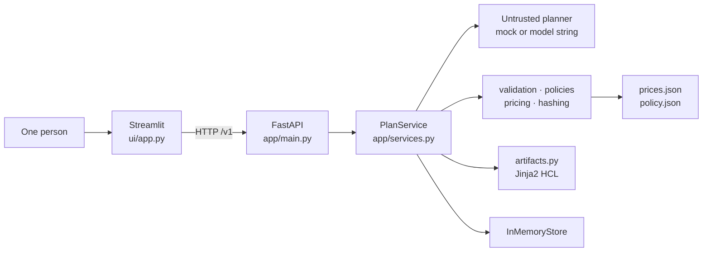
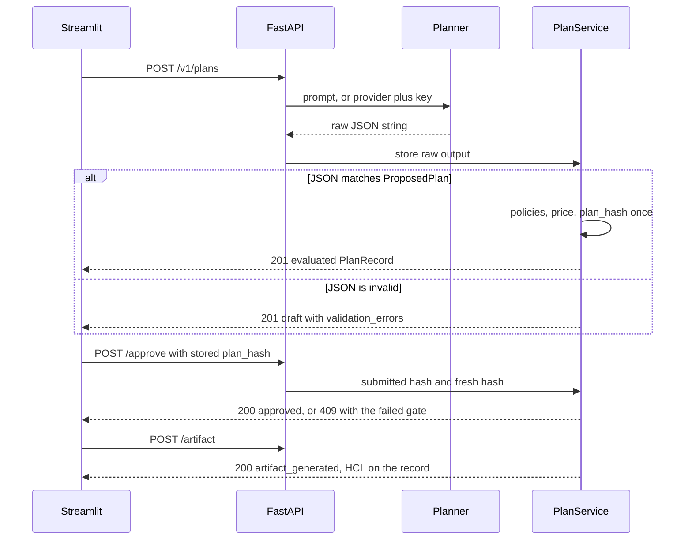
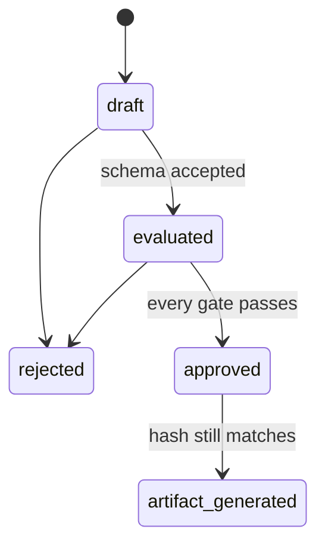

# Prompt-to-Provisioning Planner

A local prototype that turns a plain-language infrastructure request into a reviewable deployment plan. A planner proposes JSON. Application code validates that JSON, applies policy, and prices it from a local catalog. Approval is bound to a canonical hash of the proposal. An approved plan can be rendered as a dry-run Terraform-style document.

**This is a prototype.** It does not open a cloud account, read cloud credentials, or deploy infrastructure. The generated file is a fictional `main.tf`. Terraform is never executed. There is no database. Prompts, plans, decisions, and API keys are not kept after the API process stops.

## What is kept

Nothing you type is written to a database or to a file of plans.

While the API process is running, each plan sits in a Python dictionary in that process. That is why the page can show the proposal, the decision, and the dry-run file. Stop or restart the API and that dictionary is gone. Plan ids from before the restart no longer exist. Refresh then returns **404**.

| Item | Where it goes |
|---|---|
| Prompt, proposal, decision, and dry-run file | API process memory only. Lost on restart. |
| OpenAI or Anthropic API key | Sent with that one generate request. Not written to the plan, the logs, or disk. |
| Log lines | Printed to the API process stderr. They name the plan id and the outcome. They omit the sentence and the key. They end when that process ends. |
| `app/data/prices.json` and `app/data/policy.json` | Files that ship with this repository. They are the rate table and the allow-lists, not a history of requests. |

The same person writes the sentence and approves or rejects it. There is no login and no second account. The downloaded `main.tf` is a file on your computer. The application does not upload it and does not run Terraform.

| | |
|---|---|
| **Runtime** | Python 3.12, FastAPI, Streamlit |
| **Persistence** | In-memory, one API process. A restart clears every plan. |
| **Logs** | API process stderr. Each line names the plan id, status, and outcome. The request body, including any API key, is not logged. |
| **Default planner** | Deterministic vocabulary matcher. Optional OpenAI or Anthropic call, key sent with that request only. |
| **Review gate** | Schema, policy errors, and pricing must all pass, and the stored hash must still match the proposal. |
| **Output** | Dry-run HCL using fictional `demo_*` resources. |

Deeper contracts live in [ARCHITECTURE.md](ARCHITECTURE.md). This README is the document a reviewer can run from.

## Contents

1. [What is kept](#what-is-kept)
2. [What a reviewer sees](#what-a-reviewer-sees)
3. [Start the application](#start-the-application)
4. [Architecture](#architecture)
5. [Request lifecycle](#request-lifecycle)
6. [Schema](#schema)
7. [Policies](#policies)
8. [Synthetic pricing](#synthetic-pricing)
9. [Hash-bound approval](#hash-bound-approval)
10. [Dry-run artifacts](#dry-run-artifacts)
11. [HTTP API](#http-api)
12. [Streamlit client](#streamlit-client)
13. [Planners](#planners)
14. [Repository layout](#repository-layout)
15. [Tests](#tests)
16. [Design boundaries](#design-boundaries)

## What a reviewer sees

One person does both steps. There is no login and no second account. The same screen writes the sentence and approves or rejects the plan.

1. You describe a workload, for example: *A small PostgreSQL database and two web containers for a development team in US East, optimized for low cost.*
2. The app shows the untrusted planner JSON, the validated resources, the policy table, and a synthetic monthly price. That example evaluates to **USD 71.00**.
3. You approve or reject that exact plan. Approve sends the stored `plan_hash`. Reject sends the plan id only.
4. After approval, you can generate and download `main.tf`. The file states that nothing was deployed.

If the wording is wrong, write a new sentence. That creates a new plan. Reject records that the current plan must not proceed. It does not edit the sentence. The two buttons are two different actions for the same person.

A plan that fails schema stays a `draft` and is still stored (**HTTP 201**). A plan that fails policy or pricing stays `evaluated`. Approve returns **409** in both cases. A warning, such as a medium or large SKU in development, stays visible and does not block approval.

## Start the application

**Prerequisite:** Python 3.12 for a local run, or Docker with Compose.

Run **one** API worker. Plan state is a dict inside that process. A second worker would not share it. Restarting the API drops every plan. The UI must request a new plan after that restart.

### Local, without Docker

From the repository root:

```powershell
python -m venv .venv
.\.venv\Scripts\Activate.ps1
python -m pip install -r requirements-dev.txt
```

macOS and Linux use `source .venv/bin/activate` in place of the PowerShell activate line.

Start the API in the first terminal:

```powershell
python -m uvicorn app.main:app --host 0.0.0.0 --port 8000
```

Confirm it:

```powershell
curl http://127.0.0.1:8000/health
```

Expected body:

```json
{"status":"ok","service":"prompt-to-provisioning-planner"}
```

Interactive API docs are at `http://127.0.0.1:8000/docs`.

Start the UI in a second terminal, with the same virtual environment active:

```powershell
python -m streamlit run ui/app.py
```

Open `http://127.0.0.1:8501`. The app opens on **Work**.

Stop either process with Ctrl+C in its terminal.

| Variable | Where | Meaning |
|---|---|---|
| `API_BASE_URL` | UI process | API origin. Unset locally means `http://localhost:8000`. Compose sets `http://api:8000`. |

### Docker Compose

Images use `python:3.12-slim` and install `requirements.txt` only. Test packages in `requirements-dev.txt` stay on the host. The API image includes `app/`, including `app/data/` and `app/templates/main.tf.j2`. The UI image includes `ui/`, `.streamlit/`, and `docs/button-flow.html`.

```powershell
docker compose build
docker compose up -d
```

Published URLs, bound to loopback only:

| Service | URL |
|---|---|
| API health | http://127.0.0.1:8000/health |
| API docs | http://127.0.0.1:8000/docs |
| UI | http://127.0.0.1:8501 |

The API container runs `uvicorn` with `--workers 1`. The UI container starts after the API health check succeeds. Compose sets `API_BASE_URL=http://api:8000`. There is no database and no volume. `docker compose down` removes the containers and the network and leaves the images in place. Restarting the API container clears every plan.

### Five-minute review path

With the API running:

1. Open the UI and stay on **Work**.
2. Submit the suggested prompt *Small dev database and two web containers*.
3. Confirm status `evaluated`, region `us-east-1`, one `db-small` and two `container-small`, and **USD 71.00**.
4. Choose **Approve**, then **Generate artifact**, then download `main.tf`.
5. Open **Prices** and **Policies** to see the same catalogs the API enforces.
6. Open **Workflow** for the button diagram, also available as [docs/button-flow.html](docs/button-flow.html).

The same gates can be checked from the command line. The script below covers the happy path, a non-blocking warning, a schema failure, a policy failure, and a pricing failure.

<details>
<summary>Verification script</summary>

```python
import json
import urllib.error
import urllib.request

BASE = "http://127.0.0.1:8000"
HAPPY = (
    "A small PostgreSQL database and two web containers for a development team "
    "in US East, optimized for low cost."
)


def request(method, path, body=None):
    data = None if body is None else json.dumps(body).encode()
    call = urllib.request.Request(
        BASE + path,
        data=data,
        method=method,
        headers={"Content-Type": "application/json"},
    )
    try:
        with urllib.request.urlopen(call) as response:
            return response.status, json.load(response)
    except urllib.error.HTTPError as error:
        return error.code, json.load(error)


def create(prompt):
    status, record = request("POST", "/v1/plans", {"prompt": prompt})
    assert status == 201, (status, record)
    return record


happy = create(HAPPY)
assert happy["status"] == "evaluated"
assert happy["cost"]["monthly_total"] == "71"
approved_status, approved = request(
    "POST",
    f"/v1/plans/{happy['id']}/approve",
    {"plan_hash": happy["plan_hash"]},
)
assert approved_status == 200 and approved["status"] == "approved"
artifact_status, generated = request("POST", f"/v1/plans/{happy['id']}/artifact")
assert artifact_status == 200 and "Nothing was deployed." in generated["artifact"]

warning = create("A medium PostgreSQL database for a development team in US East.")
assert any(
    item["policy_id"] == "dev_medium_cost" and item["status"] == "warning"
    for item in warning["policy_checks"]
)
warning_status, _warning_approved = request(
    "POST",
    f"/v1/plans/{warning['id']}/approve",
    {"plan_hash": warning["plan_hash"]},
)
assert warning_status == 200

schema = create("SCENARIO:malformed")
assert schema["status"] == "draft"
assert schema["validation_errors"][0]["code"] == "json_invalid"
schema_status, schema_error = request(
    "POST", f"/v1/plans/{schema['id']}/approve", {"plan_hash": "a" * 64}
)
assert schema_status == 409 and schema_error["code"] == "status"

policy = create("SCENARIO:public_storage")
assert any(item["status"] == "error" for item in policy["policy_checks"])
policy_status, policy_error = request(
    "POST",
    f"/v1/plans/{policy['id']}/approve",
    {"plan_hash": policy["plan_hash"]},
)
assert policy_status == 409 and policy_error["code"] == "policy_error"

pricing = create("SCENARIO:unsupported_sku")
assert pricing["cost"]["succeeded"] is False
pricing_status, pricing_error = request(
    "POST",
    f"/v1/plans/{pricing['id']}/approve",
    {"plan_hash": pricing["plan_hash"]},
)
assert pricing_status == 409 and pricing_error["code"] == "pricing"
print("demo checks passed")
```

</details>

## Architecture

Two processes. Streamlit is an HTTP client. FastAPI owns the rules and the plan store. The UI does not import `app.services`, `app.store`, `app.policies`, or any other domain module.



The planner is the trust boundary. It may return only a raw JSON string. Validation, policy, pricing, hashing, approval, and HCL rendering are ordinary Python and run after that string is received. Generator output is stored as given. The application does not repair, coerce, or fill in invalid fields to make a plan pass.

### Modules

Business rules live in `app/services.py` and the modules it calls. Route handlers check HTTP input, call the service, and map results to status codes.

| Module | Owns | Stays out of |
|---|---|---|
| `planner.py` | A JSON string from vocabulary, or a fixed `SCENARIO:` payload | Schema, policy, price, approval, artifacts, JSON repair |
| `llm.py` | One raw string from an allowlisted OpenAI or Anthropic model | Storing the API key; the checks above |
| `validation.py` | `json.loads` and `ProposedPlan.model_validate` | Changing invalid fields |
| `policies.py` | Pass, warning, and error results from `policy.json` | Mutating the plan |
| `pricing.py` | `Decimal` totals from `prices.json` | Dropping an unpriced line; approval; HCL |
| `hashing.py` | Canonical SHA-256 of the proposal | Rewriting `plan_hash` after evaluation |
| `services.py` | Create, evaluate, approve, reject, artifact, decision list | Cloud SDKs and the Terraform CLI |
| `artifacts.py` | HCL after approval and a fresh hash check | Rendering any other status |
| `store.py` | Get, create, and update records as deep copies | Policy and pricing |
| `main.py` | HTTP routes and process logs for create, approve, reject, artifact, and refusals | Request bodies and API keys in log lines |
| `ui/app.py` | Pages, the stored hash on approve, the plan id on reject | Domain imports |

`Resource` and `ProposedPlan` are the generator contract. `PlanRecord` is the stored aggregate after the deterministic steps. A generated plan cannot supply status, cost, policy results, hashes, approval fields, or an artifact. Those fields exist only on the record.

`Planner` is a small protocol: `generate(prompt: str) -> str`. The built-in implementation is `MockPlanner`.

### Technology

| Choice | Role |
|---|---|
| Python 3.12 | Runtime |
| FastAPI | HTTP API, OpenAPI at `/docs` |
| Pydantic v2 | Authoritative schema. Generated models use `extra="forbid"` |
| Jinja2 | Deterministic HCL. The template is rendered as text and is never applied |
| Streamlit | Demo UI |
| pytest and FastAPI `TestClient` | Tests. Docker is not required |
| `requirements.txt` | Runtime packages at the repository root |
| `requirements-dev.txt` | Runtime packages plus `pytest` and `httpx` |

Approved runtime packages: `fastapi`, `uvicorn`, `pydantic`, `jinja2`, `streamlit`, `requests`.

### Persistence

`InMemoryStore` is a process dict keyed by plan id. `create`, `get`, and `update` return deep copies, so a caller cannot change the stored plan by mutating the object it received. `update` keeps the original `created_at` and sets `updated_at`. Creating an id that already exists is an error. Updating a missing id is an error. A missing get becomes **404**.

Deep copies stop accidental aliasing. They are not a lock and not durability. Run one API worker. The hash check is what detects a proposal replaced in the store after evaluation.

## Request lifecycle

Create and evaluate happen in one `POST /v1/plans`. There is no edit or patch route. Changing the prompt creates a new plan.



1. **Work** sends `POST /v1/plans`. The built-in planner sends the prompt only. OpenAI or Anthropic also sends `provider`, the fixed model id, and the API key.
2. The API calls the chosen planner and stores the raw string, including when the string is invalid. The key is not stored.
3. When the JSON matches the schema, policy and pricing run and `plan_hash` is set once. Status becomes `evaluated`, including when a policy or the price check fails. When the JSON is invalid, status stays `draft`, `proposed` is null, and policy, pricing, and hashing do not run.
4. The page shows resources, region, tags, validation, cost, and policies in one review panel. The untrusted JSON is expandable. A green tick marks a pass. A red cross marks an error and disables Approve. A warning stays visible and leaves Approve available.
5. Approve posts the stored hash. The service compares that hash with the stored hash, then recomputes a hash of the stored proposal and compares that too. The recomputed hash is not written back.
6. Artifact generation runs only for an approved plan whose current hash still matches. The HCL is stored on the record and status becomes `artifact_generated`. Generating again is refused. Read the stored HCL with `GET /v1/plans/{plan_id}`.
7. Approved, rejected, and artifact plans remain in the process and appear in the decision log through `GET /v1/decisions`.

### States



| From | Allowed | Refused |
|---|---|---|
| `draft` | Reject | Approve, artifact |
| `evaluated` | Approve when every gate passes, or reject | Artifact |
| `approved` | Artifact when the current hash still matches | Approve again, reject |
| `rejected` | Read the stored record | Approve, reject, artifact |
| `artifact_generated` | Read the stored record, including `artifact` | Approve again, reject, generate again |

`rejected` is terminal for that record. A new request is a new `POST /v1/plans`.

`status == evaluated` means the schema was accepted. It does not mean approval will succeed. Callers read `validation_errors`, policy statuses, and `cost.succeeded`. The response has no `approval_blocked` field.

## Schema

`Resource` and `ProposedPlan` in `app/models.py` are the deployment-plan schema. Unknown fields are forbidden.

**Resource types:** `container`, `postgres`, `mysql`, `object_storage`.

**Each resource:** `type`, `name`, `sku`, `quantity`, `capacity_gb`, `public_access`.

**Proposed plan:** `region`, `environment` (`dev`, `test`, or `prod`), `tags`, and `resources` with at least one item.

| Field | Rule |
|---|---|
| `quantity` | Strict integer, 1–100. Booleans, floats, and numeric strings fail. |
| `capacity_gb` | Required and greater than 0 for `object_storage`. Omitted for `container`, `postgres`, and `mysql`. |
| `name`, `sku` | 1–64 characters after trim. The original string is stored. |
| `region`, tag text | Non-blank after trim. The original string is stored. |
| `sku` | A string, not an enum. An unknown SKU can be stored, and pricing then fails closed. |
| `region` | A non-blank string. The allowed set is a policy. |
| Tags | Blank keys and values fail schema. Which keys are required is a policy. |

An unknown resource type is a schema failure. It never reaches policy.

A validation issue has `code`, `message`, and optional `field_path`.

- JSON that does not parse produces one issue: `code` is `json_invalid`, `field_path` is null, and `message` is `{JSONDecodeError.msg} at line {lineno} column {colno}`.
- A schema failure produces one issue per Pydantic error. `code` is the Pydantic `type`, such as `missing`, `extra_forbidden`, `enum`, `int_type`, `greater_than`, or `value_error`. `field_path` joins the location with `.`, and each index is written as `[n]` (`resources[0].sku`).

`GET /v1/schema/plan` returns `ProposedPlan.model_json_schema()`.

## Policies

Policies are functions from `ProposedPlan` to a list of results. They report findings and leave the plan unchanged. Thresholds and allow-lists are read from [`app/data/policy.json`](app/data/policy.json). The functions decide what those values mean. A policy with nothing to report still emits one `passed` row, so a review always lists every policy.

Each result has `policy_id`, `status` (`passed`, `warning`, or `error`), `message`, and optional `resource_name` and `field_path`.

| `policy_id` | Rule | On violation |
|---|---|---|
| `allowed_regions` | Region is `us-east-1`, `us-west-2`, or `eastus2` | error |
| `required_tags` | `environment`, `owner`, and `cost-center` are present and non-blank | error, one per missing or blank key |
| `resource_limits` | Container quantity sums to at most 5. PostgreSQL quantity sums to at most 2. MySQL quantity sums to at most 2. Object storage `capacity_gb` sums to at most 500 | error |
| `dev_sku_tier` | In `dev`, the SKU is in the allow-list for its type in `policy.json` | error |
| `storage_public` | `object_storage` with `public_access` true | error |
| `dev_medium_cost` | In `dev`, a SKU listed under `dev_warning_skus` (medium and large tiers) | warning |

Limits use `quantity` and `capacity_gb`. They do not use the length of the resource list. There is no separate known-SKU policy. Unknown SKUs fail in pricing. `eastus2` is stored and rendered as written. It is not rewritten to an AWS region name.

Error-level results block approval. Warnings do not. The current dev allow-list includes small, medium, and large SKUs for container, PostgreSQL, and MySQL. Medium and large SKUs in `dev` produce `dev_medium_cost` warnings. The **Policies** page reads `GET /v1/catalog/policy`, which returns this file.

## Synthetic pricing

Prices load from [`app/data/prices.json`](app/data/prices.json). Every unit price, line total, and monthly total is a `Decimal` built from a string. Amounts are labeled **synthetic estimates**. The API returns money as JSON strings. It does not convert money to float and does not quantize it, so the happy-path total is the string `"71"`. The UI displays that value as `USD 71.00`.

| Type | SKU | Unit price |
|---|---|---|
| Container | `container-small` | 18 per instance |
| Container | `container-medium` | 42 per instance |
| Container | `container-large` | 96 per instance |
| PostgreSQL | `db-small` | 35 per instance |
| PostgreSQL | `db-medium` | 95 per instance |
| PostgreSQL | `db-large` | 240 per instance |
| MySQL | `mysql-small` | 49 per instance |
| MySQL | `mysql-medium` | 140 per instance |
| MySQL | `mysql-large` | 320 per instance |
| Object storage | `storage-standard` | 0.025 per GB |

Worked examples:

- Two small containers and one small PostgreSQL database: `2 * 18 + 35 = 71`.
- That plan plus 100 GB of `storage-standard`: `73.50`.

Price uses `quantity`, and GB for storage. A missing type or SKU fails the whole estimate. The response has `succeeded` false and at least one pricing error. A failed estimate blocks approval. The **Prices** page reads `GET /v1/catalog/prices`.

## Hash-bound approval

`canonical_hash` covers the proposal only:

1. `proposed.model_dump(mode="json")` includes region, environment, tags, and every resource field, including `public_access` and `capacity_gb` (`null` when absent). Record id, status, timestamps, raw planner text, policies, cost, and the artifact are excluded.
2. `json.dumps(..., sort_keys=True, separators=(",", ":"), ensure_ascii=False, allow_nan=False)` sorts object keys and keeps resource list order.
3. The digest is lowercase SHA-256 hex of those UTF-8 bytes.

Evaluation writes `record.plan_hash` once. Approve, reject, and artifact generation do not overwrite it. Rejection does not compute a hash.

On approval and artifact generation the service recomputes `current_hash` and compares it with `hmac.compare_digest`. That value is not written back. If `proposed` is missing, the current hash is treated as a mismatch. Comparing only the client hash to the stored hash would accept a proposal that was changed in memory after evaluation. Both comparisons are required.

Approval succeeds only when all of the following are true:

1. `status` is `evaluated`
2. The submitted hash equals the stored `plan_hash`
3. The recomputed hash equals the stored `plan_hash`
4. `validation_errors` is empty
5. No policy result has `status` `error`
6. Pricing succeeded: `cost` is present, `succeeded` is true, there are no pricing errors, and `monthly_total` is present

The submitted hash must be 64 lowercase hexadecimal characters. Any other shape is **409** and names the hash problem (`missing_submitted_hash`, `malformed_submitted_hash`, `non_ascii_submitted_hash`, or `submitted_hash`).

Rejection takes the plan id only. `draft` and `evaluated` may become `rejected`. The proposal, `plan_hash`, validation errors, policy checks, and cost stay as stored. `approved`, `rejected`, and `artifact_generated` cannot be rejected.

`GET /v1/decisions` lists plans whose status is `approved`, `rejected`, or `artifact_generated`, newest first. Drafts and unevaluated plans stay in the store and are omitted from that list.

## Dry-run artifacts

HCL is rendered only after a successful approval, and only when a fresh hash of `proposed` still equals `plan_hash`. A `draft`, `evaluated`, or `rejected` plan cannot generate an artifact. A plan that is already `artifact_generated` is refused with **409**. Read the saved text from the record.

The document uses fictional resources only: `demo_container`, `demo_postgres`, `demo_mysql`, and `demo_object_storage`. It opens with a comment that this is a prototype dry run and that nothing was deployed. The application never calls `terraform init`, `plan`, or `apply`, and never calls a cloud provider.

Rendering is deterministic. Tags sort by key. Resources sort by type, name, SKU, quantity, whether capacity is present, capacity, and `public_access`, independent of the list order used for the hash. After sorting, labels are `container_0`, `postgres_0`, `mysql_0`, `object_storage_0`, and so on. Two renders of the same plan are identical.

Region, environment, tag keys, tag values, resource names, and SKUs are escaped before they enter the template: backslash, quotes, newlines, tabs, and other control characters, then `${` and `%{` so the text is not treated as interpolation. Counts, capacities, and `public_access` are integers or the literals `true` and `false`.

## HTTP API

Base path `/v1`. JSON only. No authentication. Handlers are async and call the service synchronously, with no await during a create, approval, rejection, or artifact transition. The store is not locked. Run one worker.

| Method | Path | Result |
|---|---|---|
| `POST` | `/v1/plans` | Create and evaluate. **201** `PlanRecord`, including a draft when planner JSON is invalid. |
| `GET` | `/v1/plans/{plan_id}` | **200** `PlanRecord`, or **404** `{ "code": "not_found", "message" }`. |
| `POST` | `/v1/plans/{plan_id}/approve` | Body `{ "plan_hash": "<64 lowercase hex>" }`. **200** updated record. **409** names the failed gate. |
| `POST` | `/v1/plans/{plan_id}/reject` | No body. **200** for `draft` or `evaluated`. **409** for `approved`, `rejected`, or `artifact_generated`. |
| `POST` | `/v1/plans/{plan_id}/artifact` | No body. **200** with HCL in `artifact`. **409** when refused, including a repeated call. |
| `GET` | `/v1/decisions` | Approved, rejected, and artifact plans, newest first. |
| `GET` | `/v1/catalog/prices` | Synthetic price table. Rates stay JSON strings. |
| `GET` | `/v1/catalog/policy` | Policy allow-lists. Check functions still apply them. |
| `GET` | `/v1/schema/plan` | `ProposedPlan` JSON Schema. |
| `GET` | `/health` | `{ "status": "ok", "service": "prompt-to-provisioning-planner" }`. |

Create body:

```json
{
  "prompt": "A small PostgreSQL database and two web containers for a development team in US East.",
  "provider": "mock",
  "model": null,
  "api_key": null
}
```

`prompt` is required and must be a non-blank string. `provider` is `mock` (the default), `openai`, or `claude`. Extra fields are rejected. Blank prompts, non-strings, and invalid UUIDs are FastAPI **422** responses with a `detail` body.

For `openai` or `claude`, `model` must be one of the allowlisted ids and `api_key` must be non-blank. The UI sends `gpt-5` or `claude-sonnet-5-5`. A provider failure is **422** `{ "code": "provider_error", "message" }` and is not stored. An unknown `SCENARIO:` name on the built-in planner is **422** `{ "code": "unknown_scenario", "message" }` and is not stored.

`PlanRecord` fields: `id`, `prompt`, `raw_output`, `generator`, `status`, `proposed`, `plan_hash`, `validation_errors`, `policy_checks`, `cost`, `artifact`, `created_at`, `updated_at`. `generator` is `mock` or `openai:<model>` / `claude:<model>`. `artifact` is null until generation. `raw_output` is the untrusted generator string so the UI can show it.

Service errors are `{ "code", "message" }` only. Responses do not include stack traces. Common **409** codes: `status`, `submitted_hash`, `current_hash`, `validation_errors`, `policy_error`, `pricing`, `missing_proposal`, `missing_plan_hash`.

## Streamlit client

`ui/app.py` talks to the API with `requests`. The horizontal menu is **Read me**, **Workflow**, **Prices**, **Policies**, and **Work**. The app opens on **Work**.

| Page | What it shows |
|---|---|
| Work | Prompt, planner choice, review panel, approve, reject, artifact download, and the in-memory decision log |
| Workflow | The button diagram from `docs/button-flow.html` |
| Prices | The synthetic catalog from `GET /v1/catalog/prices` |
| Policies | The allow-lists from `GET /v1/catalog/policy` |
| Read me | A short in-app explanation of the same flow |

The request field has a **Suggested prompts** control, including the USD 71.00 example, a medium development database (warning, approve stays available), production containers in US West, Azure East US storage, and wording the built-in planner does not recognize.

The planner control offers **Built-in**, **OpenAI**, and **Anthropic**. The model id is fixed for each provider. The API key is a password field, is sent only on that generate request, and is not written to the plan, logs, or disk.

Approve is disabled when the record has validation errors, a policy `error`, or pricing that did not succeed. Generate artifact and download `main.tf` appear after approval. The file body is the record's `artifact` field. Streamlit's header includes its theme control: light, dark, or the system default.

## Planners

Both planners are untrusted proposal generators. The checks after them are the same.

### Built-in

`MockPlanner` matches a fixed vocabulary. It does not guess.

| Phrase | Result |
|---|---|
| postgres, postgresql, database | `postgres` |
| mysql, mysql database | `mysql` |
| container, web container, web application, website | `container` |
| object storage, blob storage, s3 | `object_storage` |
| dev, development | environment `dev` |
| test | environment `test` |
| prod, production | environment `prod` |
| US East, East US, Northern Virginia, `us-east-1` | `us-east-1` |
| US West, Oregon, `us-west-2` | `us-west-2` |
| Azure East US, East US 2, `eastus2` | `eastus2` |
| small, medium, big, large | matching SKU tier |
| one, single, two, pair, couple, three, or a number | quantity |
| `N GB` or `N gigabytes` | storage `capacity_gb` |

`big` and `large` stay on the large SKU. `low cost` keeps the small default and does not replace an explicit size. A prompt with no region phrase uses `us-east-1`. A prompt with no recognized resource still returns one small web container. A different single-space `US` or `Azure` region, such as `US NORTH`, is an interpretation error. That draft has no proposed plan and cannot be approved. Tags on a recognized plan are `environment`, `owner=dev-team`, and `cost-center=engineering`. Policy code still checks those tags. The planner does not certify compliance.

`SCENARIO:<name>` skips vocabulary parsing and returns a fixed string. The string is not repaired. Names, with aliases the planner also accepts:

| Prompt name | What the fixture demonstrates |
|---|---|
| `malformed` | Truncated JSON |
| `missing_region` | Schema failure |
| `missing_tags` | Required tags absent |
| `unknown_type` | Type outside the enum |
| `unsupported_sku` | Schema-valid SKU missing from the catalog |
| `excessive_qty` | Quantity over the policy cap |
| `public_storage` | Object storage with public access |

An unknown name is **422** `unknown_scenario` and is not stored. Scenarios apply to the built-in planner.

### OpenAI and Anthropic

The Work page can send the same prompt to OpenAI (`gpt-5`) or Anthropic (`claude-sonnet-5-5`). The API allowlist is wider (`gpt-4.1-mini`, `gpt-4.1`, `gpt-5-mini`, `gpt-5`, `claude-haiku-4-5`, `claude-sonnet-5-5`, `claude-opus-5-5`) for callers that set `model` themselves. The UI has no model menu.

The model is asked to interpret typos and synonyms and to keep an explicit request even when a later check will fail. The brief is built from the live region list and price catalog. It does not ask the model to satisfy policy. The returned text is still one untrusted string. A provider timeout or transport failure is **422** `provider_error` and is not stored. The key is absent from the stored record and from the error message.

## Repository layout

```
├── README.md
├── ARCHITECTURE.md
├── AGENTS.md
├── requirements.txt
├── requirements-dev.txt
├── docker-compose.yml
├── Dockerfile.api
├── Dockerfile.ui
├── app/
│   ├── main.py              # routes
│   ├── models.py            # Pydantic schema
│   ├── services.py          # state transitions
│   ├── store.py             # in-memory records
│   ├── planner.py           # built-in generator
│   ├── llm.py               # optional model call
│   ├── validation.py
│   ├── policies.py
│   ├── pricing.py
│   ├── hashing.py
│   ├── artifacts.py
│   ├── data/prices.json
│   ├── data/policy.json
│   └── templates/main.tf.j2
├── ui/app.py
├── docs/button-flow.html
└── tests/
```

## Tests

From the repository root, with the virtual environment active:

```powershell
python -m pytest
```

Tests use FastAPI `TestClient` and inject an empty `InMemoryStore` through `dependency_overrides`. They assert HTTP status, stored status, validation errors, policy rows, decimal totals, hash mismatch, and rendered text. They do not require Docker.

Coverage includes a valid generated plan, malformed JSON, missing fields, unexpected fields, an unsupported region, missing tags, public object storage, excessive quantity, excessive storage, an unknown SKU, the decimal totals, a warning that does not block approval, errors that do, a wrong submitted hash, a proposal changed after evaluation, a proposal changed after approval and before render, a rejected plan that cannot render, two identical renders, catalog and decision routes, the optional provider boundary, and the health endpoint.

## Design boundaries

The prototype is intentionally small. One FastAPI process and one Streamlit process. Create and evaluate share a single POST. Policy numbers live in JSON so a reviewer can read the allow-lists. Policy decisions stay in functions. Prices are a table of strings so every amount is a `Decimal`.

The following stay outside this prototype:

- A required paid model. The built-in planner runs with no key.
- Cloud accounts, provider SDKs, and Terraform CLI.
- Real `aws_*` or `azurerm_*` resources, Bicep, and Kubernetes.
- A database, authentication, multi-user sessions, queues, webhooks, and a deploy pipeline.
- Editing a plan in place, a policy language, a cost optimizer, and live quota lookups.

A production system would add durable storage, authentication, a single-writer lock or a database transaction around the hash check, secret handling for model keys, and a separate apply step with human confirmation outside this process. Those controls are named here so a review can see the boundary. They are not implemented, because this build must remain a dry run.

The implementation followed [ARCHITECTURE.md](ARCHITECTURE.md) in slices: models and store, planner fixtures, validation and policy and price and hash, the plan service and routes, Jinja2 artifacts, the Streamlit client, then Compose. Cursor was used to implement and revise each slice against that document. Where the running code has moved past the original note, this README and the modules above are the source of truth: MySQL, large SKUs, `policy.json`, the decision log, the catalog routes, and the optional model call.
