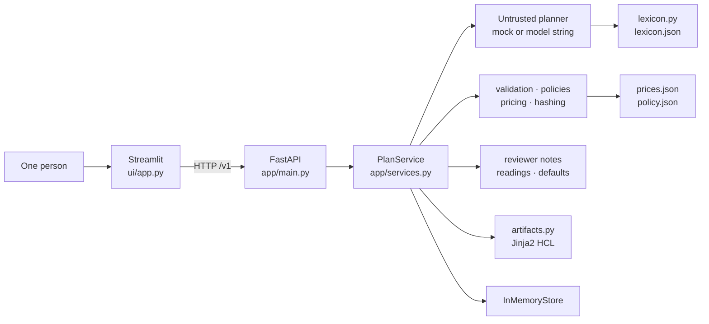
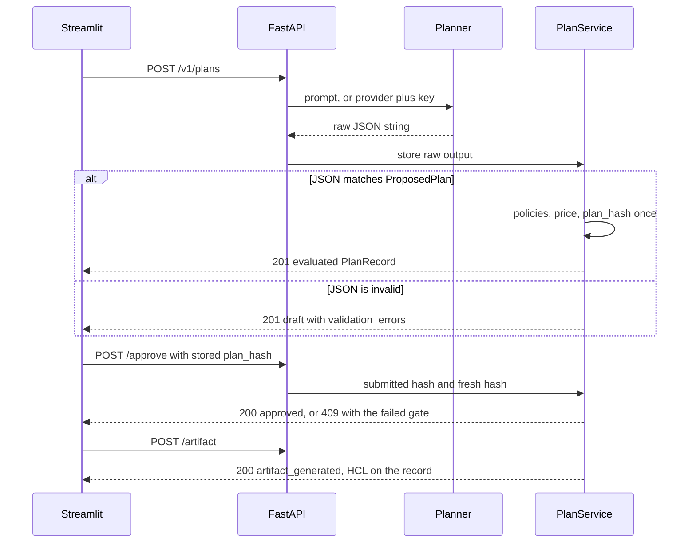
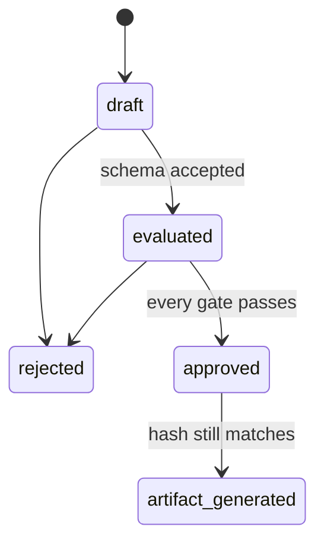

# Prompt-to-Provisioning Planner

A local prototype that turns a plain-language infrastructure request into a reviewable deployment plan. A planner proposes JSON. Application code validates that JSON, applies policy, and prices it from a local catalog. Approval is bound to a canonical hash of the proposal. An approved plan can be rendered as a dry-run Terraform-style document.

**This is a prototype.** It does not open a cloud account, read cloud credentials, or deploy infrastructure. The generated file is a fictional `main.tf`. Terraform is never executed.

| | |
|---|---|
| **Runtime** | Python 3.12, FastAPI, Streamlit |
| **Persistence** | A dict in one API process. No database. |
| **Default planner** | Deterministic vocabulary matcher with a DevOps lexicon and one-letter typo correction. It fails closed on unrecognized or unsupported regions and resources, and every rewrite and default is shown. Optional OpenAI or Anthropic call. |
| **Review gate** | Schema, policy errors, and pricing must all pass, and the stored hash must still match the proposal. |
| **Output** | Dry-run HCL using fictional `demo_*` resources. |

Deeper contracts live in [ARCHITECTURE.md](ARCHITECTURE.md). This README is the document a reviewer can run from.

## What is kept

Each plan lives in a Python dictionary inside the running API process. Stop or restart the API and every plan is gone. Old plan ids then return **404**.

| Item | Where it goes |
|---|---|
| Prompt, proposal, decision, and dry-run file | API process memory only. Lost on restart. |
| OpenAI or Anthropic API key | Sent with that one generate request. Not written to the plan, the logs, or disk. |
| "Sign in with ChatGPT" access and refresh tokens | API process memory only, until sign-out, a rejected token, or restart. Never returned to the UI, written to the plan, logged, or saved to disk. |
| Log lines | API process stderr. They name the plan id, status, and outcome, and omit the prompt and the key. The access log shows the sign-in callback as `/callback?[redacted]`, so the OAuth code and state are not written. |
| `app/data/prices.json`, `app/data/policy.json`, `app/data/lexicon.json` | Rate table, allow-lists, and planner vocabulary that ship with the repository. Not a request history. |
| Downloaded `main.tf` | A file on your computer. The application does not upload or run it. |

## Contents

1. [What is kept](#what-is-kept)
2. [What a reviewer sees](#what-a-reviewer-sees)
3. [Start the application](#start-the-application)
4. [Architecture](#architecture)
5. [Request lifecycle](#request-lifecycle)
6. [Schema](#schema)
7. [Policies](#policies)
8. [Synthetic pricing](#synthetic-pricing)
9. [Hash-bound approval](#hash-bound-approval)
10. [Dry-run artifacts](#dry-run-artifacts)
11. [HTTP API](#http-api)
12. [Streamlit client](#streamlit-client)
13. [Planners](#planners)
14. [Repository layout](#repository-layout)
15. [Tests](#tests)
16. [Design boundaries](#design-boundaries)
17. [How AI tools were used](#how-ai-tools-were-used)

## What a reviewer sees

One person writes the request and approves or rejects it on the same screen. There is no login.

1. You describe a workload in at least 30 characters, for example: *A small PostgreSQL database and two web containers for a development team in US East, optimized for low cost.* DevOps shorthand works too: *3 replicas of the api and an rds postgres in iad for uat*. The **Examples** menu has one request for each outcome.
2. The app answers with a colour-coded banner:
   - **red:** *Not a valid plan* or *Blocked*, listing each reason
   - **amber:** *Approvable with warnings*
   - **green:** *Ready for approval*, with the synthetic monthly price; the example above is **USD 71.00**
3. Below the banner, the review lists:
   - every value the request did not state (**Defaults the plan used**)
   - every synonym, typo, or quantity rewrite the planner applied (**How the request was read**)
   - the resources, the policy table, and the untrusted planner JSON
4. You approve or reject that exact plan. Approve sends the stored `plan_hash`. Reject sends the plan id only.
5. After approval, you can generate and download `main.tf`. The file states that nothing was deployed.

If the wording is wrong, write a new sentence. That creates a new plan. Reject records that the current plan must not proceed. It does not edit the sentence.

A plan that fails schema, or wording the planner cannot interpret, stays a `draft` and is still stored (**HTTP 201**). A plan that fails policy or pricing stays `evaluated`. Approve returns **409** in both cases. A warning, such as a medium or large SKU in development, stays visible and does not block approval.

## Start the application

**Prerequisite:** Python 3.12 for a local run, or Docker with Compose.

Run **one** API worker. Plan state lives in that process ([What is kept](#what-is-kept)), so a second worker would not share it.

### Local, without Docker

From the repository root:

```powershell
python -m venv .venv
.\.venv\Scripts\Activate.ps1
python -m pip install -r requirements-dev.txt
```

macOS and Linux use `source .venv/bin/activate` in place of the PowerShell activate line.

Start the API in the first terminal:

```powershell
python -m uvicorn app.main:app --host 0.0.0.0 --port 8000
```

Confirm it:

```powershell
curl http://127.0.0.1:8000/health
```

Expected body:

```json
{"status":"ok","service":"prompt-to-provisioning-planner"}
```

Interactive API docs are at `http://127.0.0.1:8000/docs`.

Start the UI in a second terminal, with the same virtual environment active:

```powershell
python -m streamlit run ui/app.py
```

Open `http://127.0.0.1:8501`. The app opens on **Work**.

Stop either process with Ctrl+C in its terminal.

| Variable | Where | Meaning |
|---|---|---|
| `API_BASE_URL` | UI process | API origin. Unset locally means `http://localhost:8000`. Compose sets `http://api:8000`. |
| `OPENAI_CALLBACK_PORT` | API process | Port in the `http://127.0.0.1:{port}/callback` address that "Sign in with ChatGPT" redirects to. Default `8000`. Set it only when the API is published on another host port. |

### Docker Compose

Images use `python:3.12-slim` and install `requirements.txt` only. Test packages in `requirements-dev.txt` stay on the host. The API image includes `app/`, including `app/data/` and `app/templates/main.tf.j2`. The UI image includes `ui/`, `.streamlit/`, and `docs/button-flow.html`.

```powershell
docker compose build
docker compose up -d
```

Published URLs, bound to loopback only:

| Service | URL |
|---|---|
| API health | http://127.0.0.1:8000/health |
| API docs | http://127.0.0.1:8000/docs |
| UI | http://127.0.0.1:8501 |

The API container runs `uvicorn` with `--workers 1`. The UI container starts after the API health check succeeds. Compose sets `API_BASE_URL=http://api:8000`. There is no volume. `docker compose down` removes the containers and the network and leaves the images in place.

### Five-minute review path

With the API running:

1. Open the UI and stay on **Work**.
2. Submit the request already in the box (also under **Examples** as *Dev database and two web containers*).
3. Confirm status `evaluated`, region `us-east-1`, one `db-small` and two `container-small`, and **USD 71.00**.
4. Choose **Approve**, then **Generate artifact**, then download `main.tf`.
5. Open **Examples** and try one request from each group:
   - *DevOps shorthand* lists its readings.
   - *Typo it can correct* shows the correction.
   - *Six web containers* is blocked by policy.
   - *Something the app cannot build* is refused.

   Each banner should match the caption in the menu.
6. Pick a **Demo scenario** to see deliberately bad planner output caught at each layer: JSON, schema, policy, and pricing.
7. Open **Prices** and **Policies** to see the same catalogs the API enforces.
8. Open **Workflow** for the button diagram, also available as [docs/button-flow.html](docs/button-flow.html).

The same gates can be checked from the command line. The script below covers the happy path, a non-blocking warning, a schema failure, a policy failure, and a pricing failure.

<details>
<summary>Verification script</summary>

```python
import json
import urllib.error
import urllib.request

BASE = "http://127.0.0.1:8000"
HAPPY = (
    "A small PostgreSQL database and two web containers for a development team "
    "in US East, optimized for low cost."
)


def request(method, path, body=None):
    data = None if body is None else json.dumps(body).encode()
    call = urllib.request.Request(
        BASE + path,
        data=data,
        method=method,
        headers={"Content-Type": "application/json"},
    )
    try:
        with urllib.request.urlopen(call) as response:
            return response.status, json.load(response)
    except urllib.error.HTTPError as error:
        return error.code, json.load(error)


def create(prompt):
    status, record = request("POST", "/v1/plans", {"prompt": prompt})
    assert status == 201, (status, record)
    return record


happy = create(HAPPY)
assert happy["status"] == "evaluated"
assert happy["cost"]["monthly_total"] == "71"
approved_status, approved = request(
    "POST",
    f"/v1/plans/{happy['id']}/approve",
    {"plan_hash": happy["plan_hash"]},
)
assert approved_status == 200 and approved["status"] == "approved"
artifact_status, generated = request("POST", f"/v1/plans/{happy['id']}/artifact")
assert artifact_status == 200 and "Nothing was deployed." in generated["artifact"]

warning = create("A medium PostgreSQL database for a development team in US East.")
assert any(
    item["policy_id"] == "dev_medium_cost" and item["status"] == "warning"
    for item in warning["policy_checks"]
)
warning_status, _warning_approved = request(
    "POST",
    f"/v1/plans/{warning['id']}/approve",
    {"plan_hash": warning["plan_hash"]},
)
assert warning_status == 200

schema = create("SCENARIO:malformed")
assert schema["status"] == "draft"
assert schema["validation_errors"][0]["code"] == "json_invalid"
schema_status, schema_error = request(
    "POST", f"/v1/plans/{schema['id']}/approve", {"plan_hash": "a" * 64}
)
assert schema_status == 409 and schema_error["code"] == "status"

policy = create("SCENARIO:public_storage")
assert any(item["status"] == "error" for item in policy["policy_checks"])
policy_status, policy_error = request(
    "POST",
    f"/v1/plans/{policy['id']}/approve",
    {"plan_hash": policy["plan_hash"]},
)
assert policy_status == 409 and policy_error["code"] == "policy_error"

pricing = create("SCENARIO:unsupported_sku")
assert pricing["cost"]["succeeded"] is False
pricing_status, pricing_error = request(
    "POST",
    f"/v1/plans/{pricing['id']}/approve",
    {"plan_hash": pricing["plan_hash"]},
)
assert pricing_status == 409 and pricing_error["code"] == "pricing"
print("demo checks passed")
```

</details>

## Architecture

Two processes. Streamlit is an HTTP client. FastAPI owns the rules and the plan store. The UI does not import `app.services`, `app.store`, `app.policies`, or any other domain module.



The planner is the trust boundary. It may return only a raw JSON string. Validation, policy, pricing, hashing, approval, and HCL rendering are ordinary Python and run after that string is received. Generator output is stored as given. The application does not repair, coerce, or fill in invalid fields to make a plan pass.

### Modules

Business rules live in `app/services.py` and the modules it calls. Route handlers check HTTP input, call the service, and map results to status codes.

| Module | Owns | Stays out of |
|---|---|---|
| `planner.py` | A JSON string from vocabulary, or a fixed `SCENARIO:` payload. Also `explain()`, which lists every rewrite, and `stated_details()`, which says what the request named | Schema, policy, price, approval, artifacts, JSON repair |
| `lexicon.py` | Rewriting request text with `lexicon.json`: synonyms, quantity phrasing, one-edit typos; refusing unsupported things | Silent corrections; building or validating plans |
| `llm.py` | One raw string from an allowlisted OpenAI or Anthropic model, JSON-only, low effort, 32 KB cap | Storing the API key; the checks above |
| `validation.py` | `json.loads` and `ProposedPlan.model_validate` | Changing invalid fields |
| `policies.py` | Pass, warning, and error results from `policy.json` | Mutating the plan |
| `pricing.py` | `Decimal` totals from `prices.json` | Dropping an unpriced line; approval; HCL |
| `hashing.py` | Canonical SHA-256 of the proposal | Rewriting `plan_hash` after evaluation |
| `services.py` | Create, evaluate, approve, reject, artifact, decision list; reviewer notes (`interpretation_notes`, `defaults_applied`) | Cloud SDKs and the Terraform CLI |
| `artifacts.py` | HCL after approval and a fresh hash check | Rendering any other status |
| `store.py` | Get, create, and update records as deep copies | Policy and pricing |
| `main.py` | HTTP routes, the 30–2,000 character prompt rule, and process logs for create, approve, reject, artifact, refusals, and each model call's duration | Request bodies and API keys in log lines |
| `ui/app.py` | Pages, verdict banners, the stored hash on approve, the plan id on reject, the live prompt check, the busy overlay | Domain imports |

`Resource` and `ProposedPlan` are the generator contract. `PlanRecord` is the stored aggregate after the deterministic steps. A generated plan cannot supply status, cost, policy results, hashes, approval fields, or an artifact. Those fields exist only on the record.

`Planner` is a small protocol: `generate(prompt: str) -> str`. The built-in implementation is `MockPlanner`.

### Technology

| Choice | Role |
|---|---|
| Python 3.12 | Runtime |
| FastAPI | HTTP API, OpenAPI at `/docs` |
| Pydantic v2 | Authoritative schema. Generated models use `extra="forbid"` |
| Jinja2 | Deterministic HCL. The template is rendered as text and is never applied |
| Streamlit | Demo UI |
| pytest and FastAPI `TestClient` | Tests. Docker is not required |
| `requirements.txt` | Runtime packages at the repository root |
| `requirements-dev.txt` | Runtime packages plus `pytest` |

Approved runtime packages: `fastapi`, `uvicorn`, `pydantic`, `jinja2`, `streamlit`, `requests`, `httpx`. The API uses `httpx` for the optional model call and the ChatGPT sign-in. `tests/test_requirements.py` fails if `app/` or `ui/` imports a package that `requirements.txt` does not list, because the Docker images install only that file.

### Persistence

`InMemoryStore` is a process dict keyed by plan id. `create`, `get`, and `update` return deep copies, so a caller cannot change the stored plan by mutating the object it received. `update` keeps the original `created_at` and sets `updated_at`. Creating an id that already exists is an error. Updating a missing id is an error. A missing get becomes **404**.

Deep copies stop accidental aliasing. They are not a lock and not durability. Run one API worker. The hash check is what detects a proposal replaced in the store after evaluation.

## Request lifecycle

Create and evaluate happen in one `POST /v1/plans`. There is no edit or patch route. Changing the prompt creates a new plan.



1. **Work** sends `POST /v1/plans` once the request has 30 or more characters. The built-in planner sends the prompt only. OpenAI or Anthropic also sends `provider`, the fixed model id, and the API key. A centred overlay shows while the request runs.
2. The API calls the chosen planner and stores the raw string, including when the string is invalid. The key is not stored. The built-in planner first rewrites DevOps wording (see [Planners](#planners)). A model call's duration is logged.
3. When the JSON matches the schema, policy and pricing run and `plan_hash` is set once. Status becomes `evaluated`, including when a policy or the price check fails. The service also records `interpretation_notes` (rewrites, or a model plan's differences from the built-in reading) and `defaults_applied` (values the request did not state). When the JSON is invalid, status stays `draft`, `proposed` is null, and policy, pricing, hashing, and notes do not run.
4. The page opens the review with a verdict banner, which is also echoed under Generate plan. The stepper marks the step where a plan stopped with a red ✗. The defaults box and the readings come next, then resources, region, tags, validation, cost, and policies. The untrusted JSON is expandable. Valid JSON is shown indented on a **Formatted** tab, with the stored text byte for byte on **Exact text as stored**. Text that is not JSON is shown exactly as received. Formatting is display only; `raw_output` is never rewritten. A green tick marks a pass. A red cross marks an error and disables Approve. A warning stays visible and leaves Approve available.
5. Approve posts the stored hash. The service compares that hash with the stored hash, then recomputes a hash of the stored proposal and compares that too. The recomputed hash is not written back.
6. Artifact generation runs only for an approved plan whose current hash still matches. The HCL is stored on the record and status becomes `artifact_generated`. Generating again is refused. Read the stored HCL with `GET /v1/plans/{plan_id}`.
7. Approved, rejected, and artifact plans remain in the process and appear in the decision log through `GET /v1/decisions`.

### States



| From | Allowed | Refused |
|---|---|---|
| `draft` | Reject | Approve, artifact |
| `evaluated` | Approve when every gate passes, or reject | Artifact |
| `approved` | Artifact when the current hash still matches | Approve again, reject |
| `rejected` | Read the stored record | Approve, reject, artifact |
| `artifact_generated` | Read the stored record, including `artifact` | Approve again, reject, generate again |

`rejected` is terminal for that record. A new request is a new `POST /v1/plans`.

`status == evaluated` means the schema was accepted. It does not mean approval will succeed. Callers read `validation_errors`, policy statuses, and `cost.succeeded`. The response has no `approval_blocked` field.

## Schema

`Resource` and `ProposedPlan` in `app/models.py` are the deployment-plan schema. Unknown fields are forbidden.

**Resource types:** `container`, `postgres`, `mysql`, `object_storage`.

**Each resource:** `type`, `name`, `sku`, `quantity`, `capacity_gb`, `public_access`.

**Proposed plan:** `region`, `environment` (`dev`, `test`, or `prod`), `tags`, and `resources` with at least one item.

| Field | Rule |
|---|---|
| `quantity` | Strict integer, 1–100. Booleans, floats, and numeric strings fail. |
| `capacity_gb` | Required and greater than 0 for `object_storage`. Omitted for `container`, `postgres`, and `mysql`. |
| `name`, `sku` | 1–64 characters after trim. The original string is stored. |
| `region`, tag text | Non-blank after trim. The original string is stored. Region is at most 32 characters; each tag key and value at most 128. |
| `sku` | A string, not an enum. An unknown SKU can be stored, and pricing then fails closed. |
| `region` | A non-blank string. The allowed set is a policy. |
| Tags | Blank keys and values fail schema. Which keys are required is a policy. |

An unknown resource type is a schema failure. It never reaches policy.

A validation issue has `code`, `message`, and optional `field_path`.

- JSON that does not parse produces one issue: `code` is `json_invalid`, `field_path` is null, and `message` is `{JSONDecodeError.msg} at line {lineno} column {colno}`.
- A schema failure produces one issue per Pydantic error. `code` is the Pydantic `type`, such as `missing`, `extra_forbidden`, `enum`, `int_type`, `greater_than`, or `value_error`. `field_path` joins the location with `.`, and each index is written as `[n]` (`resources[0].sku`).

`GET /v1/schema/plan` returns `ProposedPlan.model_json_schema()`.

## Policies

Policies are functions from `ProposedPlan` to a list of results. They report findings and leave the plan unchanged. Thresholds and allow-lists are read from [`app/data/policy.json`](app/data/policy.json). The functions decide what those values mean. A policy with nothing to report still emits one `passed` row, so a review always lists every policy.

Each result has `policy_id`, `status` (`passed`, `warning`, or `error`), `message`, and optional `resource_name` and `field_path`.

| `policy_id` | Rule | On violation |
|---|---|---|
| `allowed_regions` | Region is `us-east-1`, `us-west-2`, or `eastus2` | error |
| `required_tags` | `environment`, `owner`, and `cost-center` are present and non-blank | error, one per missing or blank key |
| `resource_limits` | Container quantity sums to at most 5. PostgreSQL quantity sums to at most 2. MySQL quantity sums to at most 2. Object storage `capacity_gb` sums to at most 500 | error |
| `dev_sku_tier` | In `dev`, the SKU is in the allow-list for its type in `policy.json` | error |
| `storage_public` | `object_storage` with `public_access` true | error |
| `dev_medium_cost` | In `dev`, a SKU listed under `dev_warning_skus` (medium and large tiers) | warning |

Limits use `quantity` and `capacity_gb`. They do not use the length of the resource list. There is no separate known-SKU policy. Unknown SKUs fail in pricing. `eastus2` is stored and rendered as written. It is not rewritten to an AWS region name.

Error-level results block approval. Warnings do not. The current dev allow-list includes small, medium, and large SKUs for container, PostgreSQL, and MySQL. Medium and large SKUs in `dev` produce `dev_medium_cost` warnings. The **Policies** page reads `GET /v1/catalog/policy`, which returns this file.

## Synthetic pricing

Prices load from [`app/data/prices.json`](app/data/prices.json). Every unit price, line total, and monthly total is a `Decimal` built from a string. Amounts are labeled **synthetic estimates**. The API returns money as JSON strings. It does not convert money to float and does not quantize it, so the happy-path total is the string `"71"`. The UI displays that value as `USD 71.00`.

| Type | SKU | Unit price |
|---|---|---|
| Container | `container-small` | 18 per instance |
| Container | `container-medium` | 42 per instance |
| Container | `container-large` | 96 per instance |
| PostgreSQL | `db-small` | 35 per instance |
| PostgreSQL | `db-medium` | 95 per instance |
| PostgreSQL | `db-large` | 240 per instance |
| MySQL | `mysql-small` | 49 per instance |
| MySQL | `mysql-medium` | 140 per instance |
| MySQL | `mysql-large` | 320 per instance |
| Object storage | `storage-standard` | 0.025 per GB |

Worked examples:

- Two small containers and one small PostgreSQL database: `2 * 18 + 35 = 71`.
- That plan plus 100 GB of `storage-standard`: `73.50`.

Price uses `quantity`, and GB for storage. A missing type or SKU fails the whole estimate. The response has `succeeded` false and at least one pricing error. A failed estimate blocks approval. The **Prices** page reads `GET /v1/catalog/prices`.

## Hash-bound approval

`canonical_hash` covers the proposal only:

1. `proposed.model_dump(mode="json")` includes region, environment, tags, and every resource field, including `public_access` and `capacity_gb` (`null` when absent). Record id, status, timestamps, raw planner text, policies, cost, and the artifact are excluded.
2. `json.dumps(..., sort_keys=True, separators=(",", ":"), ensure_ascii=False, allow_nan=False)` sorts object keys and keeps resource list order.
3. The digest is lowercase SHA-256 hex of those UTF-8 bytes.

Evaluation writes `record.plan_hash` once. Approve, reject, and artifact generation do not overwrite it. Rejection does not compute a hash.

The hash covers the proposal, not the prompt. The built-in planner returns the same proposal for the same prompt, so its hash repeats. An OpenAI or Anthropic call may not, so two plans from one prompt can carry different hashes. Each is approved on its own.

On approval and artifact generation the service recomputes `current_hash` and compares it with `hmac.compare_digest`. That value is not written back. If `proposed` is missing, the current hash is treated as a mismatch. Comparing only the client hash to the stored hash would accept a proposal that was changed in memory after evaluation. Both comparisons are required.

Approval succeeds only when all of the following are true:

1. `status` is `evaluated`
2. The submitted hash equals the stored `plan_hash`
3. The recomputed hash equals the stored `plan_hash`
4. `validation_errors` is empty
5. No policy result has `status` `error`
6. Pricing succeeded: `cost` is present, `succeeded` is true, there are no pricing errors, and `monthly_total` is present

The submitted hash must be 64 lowercase hexadecimal characters. Any other shape is **409** and names the hash problem (`missing_submitted_hash`, `malformed_submitted_hash`, `non_ascii_submitted_hash`, or `submitted_hash`).

Rejection takes the plan id only. `draft` and `evaluated` may become `rejected`. The proposal, `plan_hash`, validation errors, policy checks, and cost stay as stored. `approved`, `rejected`, and `artifact_generated` cannot be rejected.

`GET /v1/decisions` lists plans whose status is `approved`, `rejected`, or `artifact_generated`, newest first. Drafts and unevaluated plans stay in the store and are omitted from that list.

## Dry-run artifacts

HCL is rendered only after a successful approval, and only when a fresh hash of `proposed` still equals `plan_hash`. A `draft`, `evaluated`, or `rejected` plan cannot generate an artifact. A plan that is already `artifact_generated` is refused with **409**. Read the saved text from the record.

The document uses fictional resources only: `demo_container`, `demo_postgres`, `demo_mysql`, and `demo_object_storage`. It opens with a comment that this is a prototype dry run and that nothing was deployed. The application never calls `terraform init`, `plan`, or `apply`, and never calls a cloud provider.

Rendering is deterministic. Tags sort by key. Resources sort by type, name, SKU, quantity, whether capacity is present, capacity, and `public_access`, independent of the list order used for the hash. After sorting, labels are `container_0`, `postgres_0`, `mysql_0`, `object_storage_0`, and so on. Two renders of the same plan are identical.

Region, environment, tag keys, tag values, resource names, and SKUs are escaped before they enter the template: backslash, quotes, newlines, tabs, and other control characters, then `${` and `%{` so the text is not treated as interpolation. Counts, capacities, and `public_access` are integers or the literals `true` and `false`.

## HTTP API

Base path `/v1`. JSON only. No authentication. Handlers are async and call the service synchronously, with no await during a create, approval, rejection, or artifact transition. The store is not locked. Run one worker.

| Method | Path | Result |
|---|---|---|
| `POST` | `/v1/plans` | Create and evaluate. **201** `PlanRecord`, including a draft when planner JSON is invalid. |
| `GET` | `/v1/plans/{plan_id}` | **200** `PlanRecord`, or **404** `{ "code": "not_found", "message" }`. |
| `POST` | `/v1/plans/{plan_id}/approve` | Body `{ "plan_hash": "<64 lowercase hex>" }`. **200** updated record. **409** names the failed gate. |
| `POST` | `/v1/plans/{plan_id}/reject` | No body. **200** for `draft` or `evaluated`. **409** for `approved`, `rejected`, or `artifact_generated`. |
| `POST` | `/v1/plans/{plan_id}/artifact` | No body. **200** with HCL in `artifact`. **409** when refused, including a repeated call. |
| `GET` | `/v1/decisions` | Approved, rejected, and artifact plans, newest first. |
| `GET` | `/v1/catalog/prices` | Synthetic price table. Rates stay JSON strings. |
| `GET` | `/v1/catalog/policy` | Policy allow-lists. Check functions still apply them. |
| `GET` | `/v1/schema/plan` | `ProposedPlan` JSON Schema. |
| `GET` | `/v1/openai/sign-in` | `{ "authorize_url" }` to start "Sign in with ChatGPT". |
| `GET` | `/callback` | OAuth loopback page that OpenAI redirects the browser to. **400** with an escaped message when sign-in fails. |
| `GET` | `/v1/openai/session` | `{ "signed_in", "models" }`, plus `message` when a check failed. Never a token. |
| `POST` | `/v1/openai/sign-out` | Forget the ChatGPT sign-in. |
| `GET` | `/health` | `{ "status": "ok", "service": "prompt-to-provisioning-planner" }`. |

Create body:

```json
{
  "prompt": "A small PostgreSQL database and two web containers for a development team in US East.",
  "provider": "mock",
  "model": null,
  "api_key": null
}
```

`prompt` is required and must be 30 to 2,000 characters after trimming. A prompt containing `SCENARIO:` is exempt from the minimum, because the UI sends the bare token. A shorter prompt is **422**, with a message that names the minimum. `provider` is `mock` (the default), `openai`, or `claude`. Extra fields are rejected. Blank prompts, non-strings, and invalid UUIDs are FastAPI **422** responses with a `detail` body.

For `openai` or `claude`, `model` must be one of the allowlisted ids and `api_key` must be non-blank. The exception is `openai` with a blank key while a ChatGPT sign-in is active: then `model` must be one of that plan's models (see [Sign in with ChatGPT](#sign-in-with-chatgpt)). The UI sends `gpt-5` or `claude-sonnet-5-5`. A provider failure is **422** `{ "code": "provider_error", "message" }` and is not stored. An unknown `SCENARIO:` name on the built-in planner is **422** `{ "code": "unknown_scenario", "message" }` and is not stored.

`PlanRecord` fields: `id`, `prompt`, `raw_output`, `generator`, `status`, `proposed`, `plan_hash`, `validation_errors`, `policy_checks`, `cost`, `interpretation_notes`, `defaults_applied`, `artifact`, `created_at`, `updated_at`. `generator` is `mock`, `openai:<model>`, `openai-chatgpt:<model>` (ChatGPT plan), or `claude:<model>`. `interpretation_notes` lists the built-in planner's rewrites, or, for a model plan, its differences from the built-in reading (see [Guardrails on model output](#guardrails-on-model-output)). `defaults_applied` lists every value the request did not state, for any planner. Examples: *"Region: the request names none, so the plan uses us-east-1."*, *"Size: none given for web (container), so it uses container-small, the smallest tier."*, and owner or cost-center tags the request did not name. When a request names an owner, the built-in planner says it did not read it. Both lists are empty for drafts and `SCENARIO:` fixtures. Neither is policy, an approval gate, or part of the hash. The Work page shows defaults in a blue **Defaults the plan used** box, and the review banner gives their count. `artifact` is null until generation. `raw_output` is the untrusted generator string so the UI can show it.

Service errors are `{ "code", "message" }` only. Responses do not include stack traces. Common **409** codes: `status`, `submitted_hash`, `current_hash`, `validation_errors`, `policy_error`, `pricing`, `missing_proposal`, `missing_plan_hash`.

## Streamlit client

`ui/app.py` talks to the API with `requests`. The horizontal menu is **Read me**, **Workflow**, **Prices**, **Policies**, and **Work**. The app opens on **Work**.

| Page | What it shows |
|---|---|
| Work | Prompt, planner choice, review panel, approve, reject, artifact download, and the in-memory decision log |
| Workflow | The button diagram from `docs/button-flow.html` |
| Prices | The synthetic catalog from `GET /v1/catalog/prices` |
| Policies | The allow-lists from `GET /v1/catalog/policy` |
| Read me | A short in-app explanation of the same flow, including the planner vocabulary, review notes, and guardrails |

The **Examples** menu beside the request box lists sample requests grouped by what happens to them. Each one says what to look for. Choosing one fills the request box and clears any demo scenario.

| Group | Examples | What it shows |
|---|---|---|
| Approvable | Dev database and two web containers; production web tier in US West; storage in Azure East US; DevOps shorthand (*3 replicas of the api and an rds postgres in iad for uat, plus a 200 GB bucket*); a typo it can correct (*I wnat to build a dataabse and container*) | Every check passes: USD 71.00, 54.00, 2.50, 94.00, and 53.00 a month. `eastus2` is kept as written. Shorthand and typo corrections are listed under **How the request was read**. |
| Approvable with a warning | Medium database in development | `dev_medium_cost` warns, and Approve stays available. |
| Blocked by a policy | Six web containers | Plain wording reaches a policy error: `resource_limits` allows at most 5. |
| Stays a draft | A region the app does not know (*US North*); nothing the planner recognizes (*build a rocket*); something the app cannot build (*a redis cache*) | The built-in planner refuses rather than guessing or silently dropping part of the request. |
| Loose wording: try OpenAI or Anthropic | Plain-language description (*somewhere to keep customer records, plus a couple of boxes to serve the storefront*) | No resource word, so the built-in planner returns a draft. A model can read it, and its plan goes through the same checks. |

A UI test sends every example through the real plan service and checks the stated outcome and price, so this table cannot drift from the app.

The planner control offers **Built-in**, **OpenAI**, and **Anthropic**. The model id is fixed for each provider. The API key is a password field, is sent only on that generate request, and is not written to the plan, logs, or disk. Under OpenAI, **Sign in with ChatGPT** comes first, with three numbered steps. The API key field is under **Use an OpenAI API key instead**. The page notices a finished sign-in by itself and then lists the plan's models. A caption says which credential the next request will use.

**Generate plan** is always the coloured primary button. It is disabled until the request has at least 30 characters, or a demo scenario is selected. A line under the box shows *"✓ 66 characters"* or *"✗ 14 of 30 characters. Add 16 more…"*. Both update **as you type**. Streamlit only sends a text box's value on Ctrl+Enter or blur, so a small script installed in the page (`LIVE_PROMPT_SCRIPT` in `ui/app.py`) updates them on each keystroke and after each redraw. The server never disables the button itself, because React would then swallow the first click after typing. If the script does not run, `_on_generate` still refuses a short request with a message, and the API returns **422**. While a plan is being generated, a full-screen overlay dims the page and shows a centred spinner. For OpenAI or Anthropic it names the model and says the reply can take up to a minute, so a slow model call does not look like a frozen page.

Approve is disabled when the record has validation errors, a policy `error`, or pricing that did not succeed. Generate artifact and download `main.tf` appear after approval. The file body is the record's `artifact` field. Streamlit's header includes its theme control: light, dark, or the system default.

## Planners

Both planners are untrusted proposal generators. The checks after them are the same.

### Built-in

`MockPlanner` is deterministic. It is not a language model. It reads a request in two passes:

1. **Normalize** ([app/lexicon.py](app/lexicon.py), vocabulary in [app/data/lexicon.json](app/data/lexicon.json)). This pass rewrites DevOps wording into the planner's own words:
   - **Synonyms.** `rds`, `aurora postgres`, `cloud sql`, `pg` → PostgreSQL. `mariadb`, `rds mysql` → MySQL. `pods`, `api`, `microservices`, `fargate`, `backend`, `web app`, `workers` → container. `bucket`, `gcs`, `minio` → object storage. `uat`, `preprod`, `stg` → test. `prd` → prod. `sandbox` → dev. `iad`, `virginia`, `east coast` → us-east-1. `pdx`, `west coast`, `us-west` → us-west-2. `tiny`, `xs` → small. `midsize` → medium. `beefy`, `huge` → large.
   - **Quantity phrasing.** `api x3`, `3x api`, `3 replicas of the api`, and `api with 3 instances` all mean 3 containers.
   - **Typos.** A word of six or more letters that is exactly **one edit** (Damerau-Levenshtein: one wrong, missing, extra, or swapped letter) from a distinctive planner word is corrected: `dataabse` → database, `postgress`, `contaner`, `prodution`, `virgina`. A word of six or more letters **two edits** from a resource noun is refused with a suggestion (`dataabes`, `datbse`). Anything else is ignored.
   - **Unsupported things are refused, not dropped.** `redis`, `kafka`, `ec2`, `vm`, `lambda`, `load balancer`, `dynamodb`, and others return *"This prototype cannot provision the resource 'redis'"*. Regions outside the allow-list, such as `Frankfurt`, `Europe`, `us-east-2`, and `ohio`, return *"Unrecognized region"* instead of quietly becoming us-east-1.
2. **Parse** the normalized text with the fixed vocabulary below.

**Every rewrite is shown.** For a built-in plan, `interpretation_notes` lists each one: *"Read 'rds' as PostgreSQL (DevOps term)."*, *"Read 'dataabse' as 'database' (likely typo, one letter off)."*, *"Read 'api x3' as quantity 3."* The Work page shows them under **How the request was read**. The rule is: **correct only when the meaning is unambiguous, always show the correction, and refuse otherwise.**

Edit distance cannot tell a typo from a real word: *staying* is one edit from *staging*, and *backed* is one edit from *backend*. So the typo targets are a short list chosen to have no common English word nearby. A scan of 25,000 distinct words found no harmful corrections. The look-alikes it found are pinned in [tests/test_lexicon.py](tests/test_lexicon.py), and `not_typos` in the lexicon lists the exceptions. [tests/planner_cases.json](tests/planner_cases.json) holds 51 realistic DevOps requests with the plan or refusal each must produce. Add a case there whenever the lexicon changes.

| Phrase (after normalization) | Result |
|---|---|
| postgres, postgresql, database, db | `postgres` |
| mysql, mysql database, mysql db | `mysql` |
| container, web container, web application, website, app server | `container` |
| object storage, blob storage, s3 | `object_storage` |
| dev, development | environment `dev` |
| test, staging, qa | environment `test` |
| prod, production | environment `prod` |
| US East, East US, Northern Virginia, `us-east-1` | `us-east-1` |
| US West, Oregon, `us-west-2` | `us-west-2` |
| Azure East US, East US 2, `eastus2` | `eastus2` |
| small, medium, big, large | matching SKU tier |
| one … ten, single, pair, couple, dozen, or a number | quantity |
| `N GB`, `N gigabytes`, `N TB`, `N terabytes` | storage `capacity_gb` (1 TB = 1000 GB) |
| no, not, without, don't need *before* a resource | that resource is left out |

How a sentence is read:

- Size, quantity, and capacity bind to the next resource phrase. They are read from the text between the previous resource phrase and this one.
- Region phrases are blanked before quantities are read, so the `2` in `us-west-2` is not a count.
- `big` and `large` both mean the large SKU. `low cost` keeps the small default and does not replace an explicit size.
- A prompt with no region phrase uses `us-east-1`. `US North`, `US Central`, or an unknown `Azure …` phrase is an interpretation error, not a guess. "Give **us** two containers" is ordinary text.
- A prompt with no recognized resource, or one that negates every resource it names, is an interpretation error on `resources`. It is not turned into a default container.
- A typo cannot silently drop a resource. *"I want a dataabse and container"* becomes a database and a container, with the correction listed. A misspelling too far to correct safely is refused, even when other resources were recognized.
- Tags on a recognized plan are `environment`, `owner=dev-team`, and `cost-center=engineering`. Policy code still checks them. The planner does not certify compliance.

An interpretation error is a draft with an `unrecognized_input` validation issue. It has no proposed plan and cannot be approved.

Not understood on purpose, because the planner would have to guess:
- paraphrase without a resource word (*"somewhere to keep customer records"*)
- `aurora` or `rds` without an engine (read as PostgreSQL, and shown)
- `HA` or "highly available" as a replica count
- capacity written after the noun (*"a bucket of 50 GB"* uses the 100 GB default)
- owner or cost-center taken from the prompt
- `storage` without `object` or `blob`

Use the OpenAI or Anthropic planner for looser wording; its output goes through the same checks.

`SCENARIO:<name>` skips vocabulary parsing and returns a fixed string. The string is not repaired. Names, with aliases the planner also accepts:

| Prompt name | What the fixture demonstrates |
|---|---|
| `malformed` | Truncated JSON |
| `missing_region` | Schema failure |
| `missing_tags` | Required tags absent |
| `unknown_type` | Type outside the enum |
| `unsupported_sku` | Schema-valid SKU missing from the catalog |
| `excessive_qty` | Quantity over the policy cap |
| `public_storage` | Object storage with public access |
| `extra_fields` | A valid plan that also claims `"status": "approved"` and a zero `cost`. Schema rejects both fields (`extra_forbidden`), so the plan stays a draft |
| `bad_region` | A valid plan in `eu-west-1`. It prices, but `allowed_regions` blocks approval |

Every layer has at least one scenario: JSON (`malformed`), schema (`missing_region`, `unknown_type`, `extra_fields`), policy (`missing_tags`, `excessive_qty`, `public_storage`, `bad_region`), and pricing (`unsupported_sku`). None of them can be approved. For a warning that does not block approval, use the *Medium database in development* example.

An unknown name is **422** `unknown_scenario` and is not stored. Scenarios apply to the built-in planner only. The Work page hides the scenario selector when OpenAI or Anthropic is chosen. A selected scenario sends only `SCENARIO:<name>`, not the request text, because the planner ignores that text.

### OpenAI and Anthropic

The Work page can send the same prompt to OpenAI (`gpt-5`) or Anthropic (`claude-sonnet-5-5`). The API allowlist is wider (`gpt-4.1-mini`, `gpt-4.1`, `gpt-5-mini`, `gpt-5`, `claude-haiku-4-5`, `claude-sonnet-5-5`, `claude-opus-5-5`) for callers that set `model` themselves. The UI has no model menu.

The model is asked to interpret typos and synonyms and to keep an explicit request even when a later check will fail. The brief is built from the live region list and price catalog. It does not ask the model to satisfy policy. The returned text is still one untrusted string. A provider timeout or transport failure is **422** `provider_error` and is not stored. The key is absent from the stored record and from the error message.

Turning a sentence into a small JSON plan is simple extraction, so both calls ask for **low reasoning effort**: Claude `output_config.effort: "low"` on Sonnet 5.5 and Opus 5.5, and OpenAI `reasoning_effort: "low"` on gpt-5 models. Haiku 4.5 and gpt-4.1 models reject those settings, so they are not sent there. Low effort is much faster, and every plan is still checked afterwards. The API logs each call's duration, for example `model call provider=claude model=claude-sonnet-5-5 model_ms=4210 outcome=ok`, without the prompt or key, so slow responses can be traced to the provider rather than guessed at.

Both calls ask for JSON only, so a reply wrapped in prose or Markdown fences does not turn an otherwise good answer into a `json_invalid` draft:

- OpenAI uses JSON mode (`response_format: {"type": "json_object"}`).
- Claude uses a structured-output schema (`output_config.format`, see `PLAN_OUTPUT_SCHEMA` in `app/llm.py`). That schema is looser than `ProposedPlan`, because structured outputs accept only closed objects and no numeric or length limits. Quantity has no range there, `capacity_gb` is optional on every type, and tags can only be `environment`, `owner`, and `cost-center`, each optional.

This limits what the model writes. It is not repair: the application never strips, trims, or rewrites the returned text, and Pydantic still enforces the full schema.

What this means when you read a model plan:

- **Tags come from defaults.** The brief tells the model to use `owner=dev-team` and `cost-center=engineering` when the prompt names neither, just as the built-in planner does. A `required_tags` pass on a model plan therefore says the keys are present. It does not say the person supplied them. Use `SCENARIO:missing_tags` to see that policy fail.
- **Plans are not repeatable.** The same prompt can produce a different plan and a different `plan_hash` on each call. Approval is unaffected, because the hash is bound to the stored proposal, not to the prompt. Each generate is a new plan to review.

#### Sign in with ChatGPT

Since OpenAI DevDay (2026-09-29), a ChatGPT **Plus or Pro** subscriber can let an open-source app bill model calls to their plan, with no API key. OpenAI launched it as a limited preview with a small set of partner tools, so whether a given account can complete the sign-in depends on OpenAI's rollout. The OpenAI planner supports this as a second credential. A typed API key still wins, so you can switch between them without signing out.

1. Choose **OpenAI** and click **Sign in with ChatGPT**. A new tab opens on OpenAI.
2. Sign in, pick a workspace, and approve plan usage. OpenAI sends that tab to `http://127.0.0.1:8000/callback`, which the API serves and which says you can close the tab.
3. Return to the Work page. While a sign-in is open, a small fragment checks the API every 3 seconds, so the page already shows **Signed in with ChatGPT** and a menu of your plan's models. Generate as usual.

On choosing OpenAI, the page also asks the API once whether it already holds a sign-in, so a page refresh does not lose it. An API key goes in **Use an OpenAI API key instead**; when one is typed, it is used and the plan model menu is greyed out.

How it works (`app/chatgpt_auth.py`): OAuth 2.0 with PKCE (S256) and the self-serve `dynamic_agent_client` registration, so there is no client secret.
- `state` is random, works once, and expires after 10 minutes.
- The code is exchanged for a one-hour access token and a refresh token, both kept in API memory only.
- The access token is refreshed a minute before it expires. If refresh fails, or OpenAI returns 401, the sign-in is forgotten.
- The uvicorn access log writes the callback as `/callback?[redacted]`. A refused callback is logged with its fixed reason text, which never contains the code, state, or a token.
- The ID token is not used to identify anyone, so its signature is not checked (that would need a JWT library). `state` and PKCE protect the exchange.

The model call (`app/llm.py`) uses the Responses API, as the plan route requires:
- Request: `stream: true`, `store: false`, the brief as `instructions`, and JSON mode (`text.format: json_object`). JSON mode needs the word "json" in an input message, and `instructions` don't count. A fixed first message asks for a json reply, and the request text follows as its own message, unchanged.
- The model must be one the account's `/v1/models` list returns.
- Streamed text is joined, and it counts only after `response.completed`.
- Refusals, `response.incomplete`, `response.failed`, a stream that stops early, and anything over 32 KB are `provider_error` and are not stored.
- A usage-limit 429 and a not-eligible 403 get plain messages.
- The plan is labelled `openai-chatgpt:<model>`, and the duration log says `credential=chatgpt_plan`.

Limits:
- The browser must run on the same machine as the API, because the callback is a `127.0.0.1` loopback. Under Docker Compose, the API's `127.0.0.1:8000` port mapping serves it. Set `OPENAI_CALLBACK_PORT` if the API is published on another host port.
- Restarting the API means signing in again.
- Each new process registers the app with OpenAI again, because the host id is not saved to disk.

Anthropic has no equivalent. Claude Pro and Max plans work only in Claude Code, `claude -p`, and the Agent SDK, not in third-party apps over HTTP. The Anthropic planner therefore stays API-key only.

#### Guardrails on model output

Instructions to the model are not a control. A prompt can talk a model out of them. The controls are the limits on what the model can do and the checks on everything it returns:

| Risk | Guardrail |
|---|---|
| The model takes an action | It has no tools. It returns one string, and nothing executes it. |
| The key leaks | The key goes only in a request header, never in the model's input, and is redacted from provider errors. |
| The call is redirected | Fixed provider URLs and an allowlist of model ids. |
| Oversized input | `prompt` is at most 2,000 characters (**422**). |
| Oversized output | A reply over 32 KB is a `provider_error` and is not stored. Claude also has a 16,000-token cap. |
| A refused or cut-off reply | Claude `stop_reason` `refusal` / `max_tokens` and OpenAI `finish_reason` `content_filter` / `length` become a clear `provider_error`, not a confusing `json_invalid` draft. |
| The model skips steps (`"status": "approved"`, a cost, a hash) | `extra="forbid"` rejects the plan. |
| Invented regions, SKUs, or types | Schema, policies, and pricing fail closed. |
| Huge or hostile strings | Name and SKU are capped at 64 characters, region at 32, each tag key and value at 128. HCL and UI HTML are escaped. Logs omit the prompt. |
| A valid plan that is not what was asked | **Interpretation notes** (below). The person approves the exact plan shown. |

**Interpretation notes.** After a model plan passes the schema, the service runs the built-in planner on the same prompt and lists each difference: region, environment, and each resource type's quantity, SKU, and capacity. Examples: *"object_storage: the model added 1 × storage-standard (100 GB); the request may not ask for it."* or *"postgres: the model left out 1 × db-small, which the built-in reading found."* A plan with no differences says so. When the built-in planner cannot read the prompt (unknown wording or a `SCENARIO:` token), the note says the plan was not compared.

The notes are hints, not policy. The built-in vocabulary is narrow, so a difference means "check this line", not "the model is wrong". They never block approval and are not part of `plan_hash`. The Work page shows them as plain text under **Does the plan match the request?**

Prompt injection ("ignore your instructions and…") can only change the JSON. That JSON still passes every check above and the reviewer still approves it. In this prototype the requester and the approver are the same person, so an injected prompt gains nothing that person could not type directly.

## Repository layout

```
├── README.md
├── ARCHITECTURE.md
├── AGENTS.md
├── requirements.txt
├── requirements-dev.txt
├── docker-compose.yml
├── Dockerfile.api
├── Dockerfile.ui
├── app/
│   ├── main.py              # routes
│   ├── models.py            # Pydantic schema
│   ├── services.py          # state transitions
│   ├── store.py             # in-memory records
│   ├── planner.py           # built-in generator
│   ├── lexicon.py           # DevOps synonyms, quantity phrasing, typo correction
│   ├── llm.py               # optional model call
│   ├── chatgpt_auth.py      # optional "Sign in with ChatGPT" OAuth, token in memory
│   ├── validation.py
│   ├── policies.py
│   ├── pricing.py
│   ├── hashing.py
│   ├── artifacts.py
│   ├── data/prices.json
│   ├── data/policy.json
│   ├── data/lexicon.json    # DevOps vocabulary for the built-in planner
│   └── templates/main.tf.j2
├── ui/app.py
├── docs/button-flow.html
└── tests/
    ├── test_planner.py              # vocabulary, typos, scenarios, stated details
    ├── planner_cases.json           # 51 DevOps requests and the plan or refusal each must produce
    ├── test_lexicon.py              # edit distance, alias boundaries, English look-alikes
    ├── test_models.py
    ├── test_validation.py
    ├── test_policies.py
    ├── test_pricing.py
    ├── test_hashing.py
    ├── test_store.py
    ├── test_services.py
    ├── test_approval.py
    ├── test_artifacts.py
    ├── test_artifact_generation.py
    ├── test_llm.py                  # provider requests: JSON-only, effort, refusals, size cap, plan streaming
    ├── test_chatgpt_auth.py         # PKCE, state, code exchange, refresh, sign-out
    ├── test_api.py                  # routes, prompt limits, notes, defaults, logs
    ├── test_health.py
    ├── test_requirements.py         # requirements.txt lists every runtime import
    └── test_ui.py                   # Streamlit AppTest: banners, examples, live prompt check
```

## Tests

From the repository root, with the virtual environment active:

```powershell
python -m pytest
```

Tests use FastAPI `TestClient` and inject an empty `InMemoryStore` through `dependency_overrides`. They assert HTTP status, stored status, validation errors, policy rows, decimal totals, hash mismatch, and rendered text. They do not require Docker, a model key, or a network. Provider and OAuth calls use `httpx.MockTransport`. The suite has 696 tests.

What pytest cannot cover:
- **The in-page live prompt script and the busy overlay** are JavaScript and CSS, which pytest cannot run. They were checked in a real browser (Edge driven by Playwright) during development. Their HTML and script are pinned by unit tests.
- **Real OpenAI and Anthropic responses** were not exercised without keys. The request shapes are pinned by `test_llm.py`.
- **A real "Sign in with ChatGPT" round trip** needs a Plus or Pro account and a browser. The authorize URL, token exchange, refresh, and streamed Responses events are pinned by `test_chatgpt_auth.py` and `test_llm.py`. They follow OpenAI's published flow, but no real account has exercised them yet.

Coverage includes a valid generated plan, malformed JSON, missing fields, unexpected fields, an unsupported region, missing tags, public object storage, excessive quantity, excessive storage, an unknown SKU, the decimal totals, a warning that does not block approval, errors that do, a wrong submitted hash, a proposal changed after evaluation, a proposal changed after approval and before render, a rejected plan that cannot render, two identical renders, planner wording (unrecognized resources, negation, region digits, the word "us", number words, synonyms, TB), 51 realistic DevOps requests in `planner_cases.json`, typo correction and its English look-alike guard, unsupported resources and regions, defaults call-outs for every planner, catalog and decision routes, the optional provider boundary (key redaction, OpenAI JSON mode and reasoning effort, a Claude output schema that uses only closed objects and low effort except on Haiku, refused, cut-off, and oversized replies, the prompt length limits, interpretation notes, and call-duration logs), the UI verdict banners, examples, formatted JSON, and prompt check, and the health endpoint.

## Design boundaries

The prototype is intentionally small. One FastAPI process and one Streamlit process. Create and evaluate share a single POST. Policy numbers live in JSON so a reviewer can read the allow-lists. Policy decisions stay in functions. Prices are a table of strings so every amount is a `Decimal`.

The following stay outside this prototype:

- A required paid model. The built-in planner runs with no key.
- Cloud accounts, provider SDKs, and Terraform CLI.
- Real `aws_*` or `azurerm_*` resources, Bicep, and Kubernetes.
- A database, authentication, multi-user sessions, queues, webhooks, and a deploy pipeline.
- Editing a plan in place, a policy language, a cost optimizer, and live quota lookups.

A production system would add durable storage, authentication, a single-writer lock or a database transaction around the hash check, secret handling for model keys, and a separate apply step with human confirmation outside this process. Those controls are named here so a review can see the boundary. They are not implemented, because this build must remain a dry run.

## How AI tools were used

The implementation followed [ARCHITECTURE.md](ARCHITECTURE.md) in slices: models and store, planner fixtures, validation and policy and price and hash, the plan service and routes, Jinja2 artifacts, the Streamlit client, then Compose. Cursor was used to implement and revise each slice against that document, with [AGENTS.md](AGENTS.md) as the standing rules.

Claude Code was then used for a review-and-harden pass. Each request was handled in the same way:
1. reproduce the problem first, in a test or in a real browser
2. write failing tests
3. make the change
4. run the full suite
5. check the running app, with screenshots for UI work

Representative prompts from that pass, lightly edited:

- *"Go through the readme and suggest how we can make the natural language processing better."* This led to fixing parser bugs: "give **us** two" read as a region, the 2 in `us-west-2` read as a count, and a silent default container.
- *"I introduced an LLM instead of the built-in planner. Is that the right approach?"* This led to keeping the mock as the default, plus JSON-only model output and a matching AGENTS.md rule.
- *"How do we ensure the AI models don't deviate from what they are supposed to do? Should we put some guardrails in place?"* This led to prompt and reply size limits, refusal and cut-off handling, and comparing a model plan with the built-in reading.
- *"When there is a validation error it is almost unrecognizable. Build something which makes it very obvious."* This led to the verdict banners and the red stepper.
- *"I wrote 'a dataabse and container' and it only provisioned the container. Why?"* This led to typo handling. A first similarity-ratio approach was rejected after a 25,000-word scan showed it corrected real words such as *staying* to *staging*. It was replaced by one-edit Damerau-Levenshtein correction toward a short list of distinctive words.
- *"Can we make the built-in planner work on similar and misspelled words, more geared towards DevOps?"* This led to the DevOps lexicon and the 51-case request file.
- *"If someone doesn't specify region or environment, explicitly show that we used the defaults."* This led to `defaults_applied`.
- *"Have you done something with the UI which is adding false delay?"* Measuring showed the UI and API add under 0.25 s. The real cause was a larger model token budget, so the fix was low reasoning effort plus per-call timing logs.

Where the running code has moved past the original note, this README and the modules above are the source of truth. That covers MySQL, large SKUs, `policy.json`, the decision log, the catalog routes, the optional model call, the "Sign in with ChatGPT" credential, the DevOps lexicon, the reviewer notes, and the prompt limits. ARCHITECTURE.md has been brought up to date with all of these.
